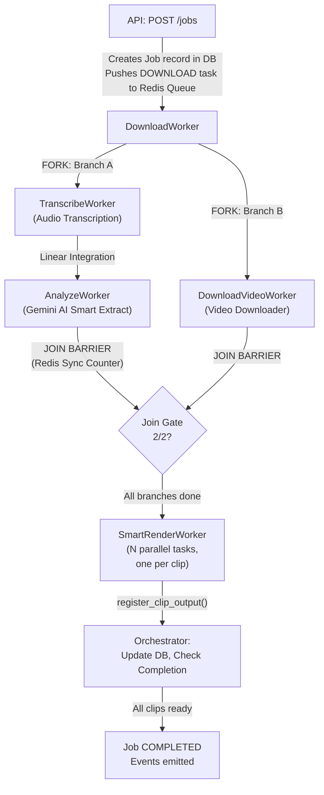

# Julius AI Clipper — Enterprise-Grade AI Video Clipping & Rendering Pipeline

[](#)
[](#)
[](#)
[](#)
[](#)

Julius is a high-performance, multi-tenant AI video clipping and rendering platform. Given a source video file or YouTube URL, Julius orchestrates a parallel processing pipeline that downloads the source media, extracts audio tracks, transcribes the speech, runs AI heuristic analysis via the Google Gemini API to identify viral segments, compiles sub-second word-level subtitles, and renders optimized short-form vertical video clips styled with premium layouts and real-time audio waveforms.

---

## 1. End-to-End Pipeline Architecture

Julius uses a **Fork-Join parallel architecture** orchestrated by a transactional outbox queue pattern to achieve maximum processing throughput and database reliability.



### End-to-End Data Pipeline Flow

| Stage | Process Type | Worker / Component | Input Payload | Output Artifact | Storage Footprint |
| :--- | :--- | :--- | :--- | :--- | :--- |
| **1. Ingest / Pull** | `DOWNLOAD` / `INGEST` | `DownloadWorker` | YouTube URL / Video Upload | Audio WAV & Source MP4 | `users/{id}/library/audios/` & `videos/` |
| **2. Transcribe** | `TRANSCRIBE` | `TranscribeWorker` | Audio WAV Key | Word-level JSON Transcript | `users/{id}/library/cache/{clip}_transcript.json` |
| **3. AI Analyze** | `ANALYZE` | `AnalyzeWorker` | Transcript JSON | Viral Clip Segments Metas | `users/{id}/library/cache/{clip}_analysis.json` |
| **4. Render & Brand** | `SMART_RENDER` | `SmartRenderWorker` | Segment Times, Layout Styles | Processed Vertical Video | `users/{id}/jobs/{date}/{job_id}/clips/` |

---

## 2. Core Feature Pillars

### 🔐 1. Multi-Tenancy & Enterprise Auth (Epics 5 & 6)
* **Organization & Workspace Isolation**: Clean multi-tenancy logical isolation model where users belong to organizations and workspaces.
* **Granular RBAC**: Normalized Role-Based Access Control enforcing specific privileges (`billing.manage`, `editor.read`, `workspace.admin`) evaluated by a custom Spring Security `PermissionEvaluator`.
* **Token Rotation (RTR)**: Hardened JWT authentication with Refresh Token Rotation grace periods and SameSite response cookie security.

### 🎥 2. Intelligent Render & Clipping Engine (Epics 8.5 & 9)
* **Subtitle Compiler**: Compiles precision word-level timestamps to generate styled captions and subtitle files overlaying video clips.
* **Audio Waveform Peaks**: Extract and normalized amplitude arrays from media files to render interactive UI wave previews.
* **Sprite Strip Tiling**: FFmpeg-powered thumbnail sprite generators allowing high-speed client-side timeline scrubbers.

### 💳 3. Double-Entry Billing & Quotas (Epic 12)
* **Double-Entry Ledger**: Full credit/debit transaction log matching parity across `Journal`, `Account`, `Transaction`, and `JournalEntry` schemas.
* **CAS Quota Engine**: Compare-And-Swap (CAS) database atomic locking on resource usage queries to prevent double-spending concurrency leaks.
* **Stripe Billing Portal**: Dynamic subscription hooks supporting signature-verified, replay-resistant webhook event handlers.

### 📊 4. Telemetry & Distributed Metrics
* **Decentralized Metrics**: Prometheus-compatible custom gauges and counters for queues, API endpoints, pipelines, and AI invocation rates.
* **Correlation ID Propagation**: MDC thread context logs masking credentials while tracing jobs across worker boundaries.

---

## 3. Local Development Setup & Execution

### Prerequisites

| Software Dependency | Minimum Version | Installation Command (Windows) | Installation Command (macOS) |
| :--- | :--- | :--- | :--- |
| **JDK (Java Dev Kit)** | JDK 21 | `winget install Eclipse.Temurin.21.JDK` | `brew install openjdk@21` |
| **Maven** | Maven 3.9+ | `winget install Apache.Maven` | `brew install maven` |
| **Node.js & npm** | Node.js v20.x | `winget install OpenJS.NodeJS.LTS` | `brew install node` |
| **Docker Desktop** | Docker 25+ | `winget install Docker.DockerDesktop` | `brew install --cask docker` |
| **FFmpeg CLI** | FFmpeg 6.0+ | `winget install Gyan.FFmpeg` | `brew install ffmpeg` |

---

### Step 1: Spin Up Infrastructure (PostgreSQL & Redis)
Julius uses PostgreSQL 16 for persistent relational schemas and Redis for scheduling queues and cache storage.

From the root directory, start the background services:
```bash
docker compose up -d
```
Verify the health of the containers:
```bash
docker compose ps
```
* **PostgreSQL** runs on `localhost:5433` (Credentials: User: `julius` / Password: `julius` / DB: `julius`).
* **Redis** runs on `localhost:6379`.

---

### Step 2: Configure Environment Variables
Create a file named `.env` in the root directory:
```env
# Gemini API Key (Required for AI clipping)
GOOGLE_API_KEY=your_gemini_api_key_here

# Local Mock Stripe Credentials
STRIPE_API_KEY=sk_test_mock_123
STRIPE_WEBHOOK_SECRET=whsec_mock_123
```

---

### Step 3: Set Up and Run the Backend (Spring Boot Server)

1. Build the application and download dependencies:
   ```bash
   mvn clean install -DskipTests
   ```
2. Run the Spring Boot application:
   ```bash
   mvn spring-boot:run
   ```
* The API backend server runs on **`http://localhost:8080`**.
* Flyway migrations run automatically on startup (`V1` to `V7`), seeding the database with development mock datasets.

---

### Step 4: Set Up and Run the Frontend (Next.js Application)

The web client interface is situated inside the `web-interface/` directory.

1. Navigate to the web directory:
   ```bash
   cd web-interface
   ```
2. Install npm dependencies:
   ```bash
   npm install
   ```
3. Boot up the developer server (leveraging the Turbopack engine):
   ```bash
   npm run dev
   ```
* The web application runs on **`http://localhost:3000`**.
* The API calls are proxied to your local backend server at `http://localhost:8080` (configured via Next.js proxy middlewares).

---

### Step 5: Test Stripe Webhook Local Forwarding (Optional)
To process payments and subscription lifecycle updates locally:
1. Log in via the [Stripe CLI](https://stripe.com/docs/stripe-cli).
2. Start forwarding events:
   ```bash
   stripe listen --forward-to http://localhost:8080/api/billing/webhook
   ```
3. Grab the generated signing secret (starts with `whsec_`) and update `STRIPE_WEBHOOK_SECRET` in your `.env` configuration file.

---

## 4. Testing & Verification Suites

Ensure absolute stability across your code changes by running both verification suites:

### Running Backend Integration & Unit Tests
```bash
mvn test
```
*Note: Testcontainers will dynamically fall back to in-memory configurations if the local Docker agent is unavailable.*

### Running Frontend Vitest & Lint Checks
```bash
cd web-interface
npx vitest run
npm run lint
```

---

## 5. Troubleshooting Diagnostics

* **FFmpeg Command Failures**: Ensure `ffmpeg` is globally executable. Run `ffmpeg -version` in your terminal. If it fails, add the directory housing the binary to your environment's path variables.
* **Docker Port Conflicts**: If port `5433` or `6379` is already bound by host services, modify the mappings inside `docker-compose.yml` to prevent binding overlaps.
* **Corrupted Flyway Databases**: To reset the schema migration versioning and start with fresh seeded data, run:
  ```bash
  docker compose down -v
  docker compose up -d
  ```

---

## 6. Architectural Decision Records (ADRs)

For deep insights into architectural design paths chosen during implementation, refer to:
* **[ADR-005] Configuration Management System**: Environment-driven records mapping.
* **[ADR-006] Extensible Feature Flags**: Runtime toggles.
* **[ADR-008] Multi-Tenant RBAC & Evaluators**: Tenant partitioning and expression security.
* **[ADR-013] Subtitle Compiles & Media Generating**: Waveforms and sprite sheets pipelines.
* **[ADR-014] Double-Entry Billing Engine**: Resilient ledger balances and CAS locking checks.
