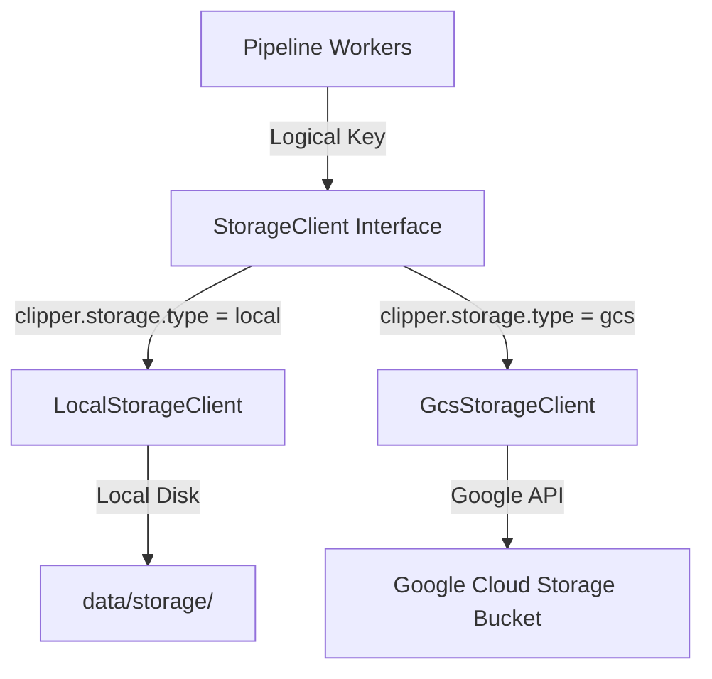

# Julius Cloud-Native Storage Engineering Guide

Julius implements a provider-agnostic, stream-oriented object storage abstraction layers to decouple the pipeline workers from filesystem dependencies. This guide outlines the architecture, namespace key structures, local development simulator, and worker patterns.

## 1. Abstraction Architecture

The storage system consists of the following components:
*   `StorageClient`: The core interface defining standard GCS-equivalent operations (`upload`, `download`, `exists`, `delete`, `getMetadata`, `generateSignedUrl`).
*   `UploadRequest` & `StoredObject`: Strongly typed models containing input streams and metadata snapshots (checksums, file sizes, content types).
*   `StorageKeyBuilder`: Namespace standardizer enforcing prefix scopes and preventing path traversals.



## 2. Standard Namespaces & Keys

All storage keys must be generated using `StorageKeyBuilder` to ensure consistency:

| Scope | Prefix / Pattern | Helper Method | Purpose |
| :--- | :--- | :--- | :--- |
| Raw Video | `raw/video_{clipId}.mp4` | `StorageKeyBuilder.rawVideo` | Ingested or downloaded source video |
| Raw Audio | `raw/audio_{clipId}.wav` | `StorageKeyBuilder.rawAudio` | Extracted & transcoded audio tracks |
| Job Clips | `jobs/{jobId}/clips/clip_{index}_{templateRef}.mp4` | `StorageKeyBuilder.jobClip` | Rendered clip fragments |
| Job Transcripts | `jobs/{jobId}/transcripts/transcript_{clipId}.json` | `StorageKeyBuilder.jobTranscript` | Cached Whisper JSON output |
| Cache Analysis | `cache/analysis_{clipId}.json` | `StorageKeyBuilder.cacheAnalysis` | Transient AI analysis results |
| Library Videos | `library/videos/` | `StorageKeyBuilder.libraryVideo` | User-ingested video source |
| Library Audios | `library/audios/` | `StorageKeyBuilder.libraryAudio` | User-ingested audio source |

## 3. Local Development (Disk Simulation)

By default, Julius runs with `clipper.storage.type=local` in the default and test profiles.
*   **Storage Root**: Uploads are saved inside the `data/storage` (dev) or `data/storage_test` (test) directories.
*   **Metadata Sidecar**: Every object `foo.mp4` has a sidecar JSON file `foo.mp4.metadata.json` containing size, creation timestamp, content type, and the MD5 checksum.
*   **Signed URLs**: Simulates GCS signed URLs returning a mocked link pointing to a download API endpoint.

## 4. Worker Streaming Patterns

Workers must never reference absolute local files directly for processing. Instead, follow the standard download-process-upload pattern:

```java
// 1. Download to transient local file
File tempFile = File.createTempFile("worker_scratch_", ".tmp");
try (OutputStream out = new FileOutputStream(tempFile)) {
    storageClient.download(sourceKey, out);
}

// 2. Perform process operation (e.g. ffmpeg, yt-dlp)
String outputLocalPath = processLocalFile(tempFile.getAbsolutePath());

// 3. Upload output to Storage Client
File outputLocalFile = new File(outputLocalPath);
try (InputStream in = new FileInputStream(outputLocalFile)) {
    storageClient.upload(new UploadRequest(
        targetKey,
        in,
        outputLocalFile.length(),
        "video/mp4",
        null,
        null
    ));
} finally {
    // 4. Purge all local transient files
    tempFile.delete();
    outputLocalFile.delete();
}
```

## 5. Micrometer Metrics

The storage layer automatically publishes performance metrics:
*   `clipper.storage.bytes.uploaded`: Counter tracking upload volume in bytes.
*   `clipper.storage.bytes.downloaded`: Counter tracking download volume in bytes.
*   `clipper.storage.failures`: Counter tracking exceptions tagged by `provider`, `operation`, and `exception`.
*   `clipper.storage.operation.duration`: Timer recording call latencies tagged by `provider` and `operation`.
