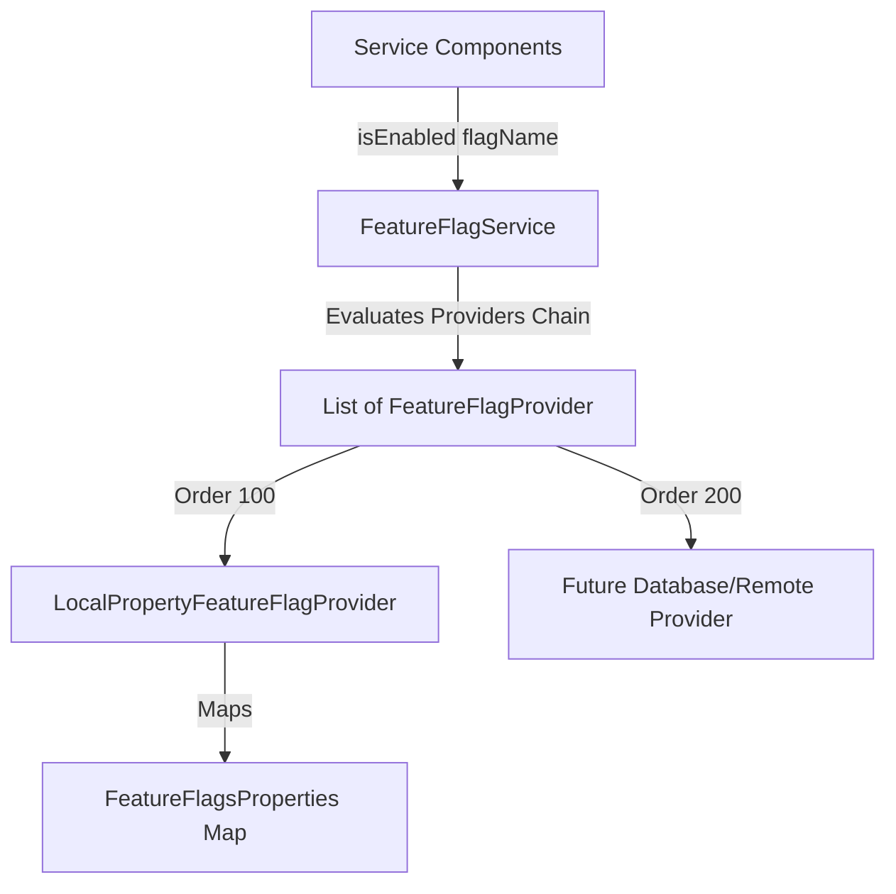

# ADR 006: Feature Flag Architecture

## Status
Accepted

## Context
In previous configurations, feature toggles were checked directly against environment strings or simple manual managers. This setup hindered provider extensibility (e.g., swapping local overrides with remote database lookups) and lacked validation alignment with the Epic 4 configuration principles.

## Decision
We implement a decoupled, provider-based Feature Flag architecture.



### 1. Provider Chain & Precedence Ordering
*   `FeatureFlagService` resolves flags by querying a sorted list of `FeatureFlagProvider` beans.
*   Evaluation occurs in sequential order matching the provider's class-level `@Order` annotation (lower values evaluate first).
*   The first provider that returns a present value (`Optional.of(Boolean)`) determines the flag state. If a provider returns `Optional.empty()`, lookup falls back to the next provider in the chain.

### 2. Typed Configuration Model vs Direct `Environment` Access
*   **Rationale for Avoiding `Environment`**: Direct calls to Spring's `Environment.getProperty()` create an untracked, scattered runtime dependency on raw key lookups. Binding toggles to a configuration class registers them with the container lifecycle, enabling startup validation checks, sanitization logs, and deterministic fingerprinting.
*   **`FeatureFlagsProperties` Map Model**: We bind `clipper.features.*` to a typed `Map<String, Boolean> features`. This dynamic map allows operators to inject any arbitrary new toggle key at runtime (via properties files or OS environment overrides) without requiring code recompilation or record field additions.

### 3. Contract for Future Providers
Future provider implementations must satisfy the following architectural contracts:
*   **Caching**: Must resolve lookups in $O(1)$ time. External providers (e.g., GCS, remote APIs, database) must implement an internal caching mechanism to prevent blocking operations.
*   **Refreshes**: Cache refreshes must occur asynchronously or reactively (e.g., via background schedulers or event-based listeners).
*   **Failure Resilience**: If an external provider encounters a connection crash, it must log the failure at `ERROR` level and return `Optional.empty()`, letting the toggle safely fall back to the next provider or baseline default.

### 4. Contextual Extensibility
The `FeatureFlagService` reserves room for future contextual evaluation. To support targeting specific tenants, rollout percentages, or user cohorts, the API can be extended with a contextual lookup argument:
```java
boolean isEnabled(String flagName, FeatureContext context, boolean defaultValue);
```

## Consequences
*   Feature toggling is decoupled from environment strings.
*   Operators can dynamically inject toggles at runtime via local property variables.
*   The system easily integrates database or third-party feature flag platforms by adding ordered provider beans to the Spring context.
