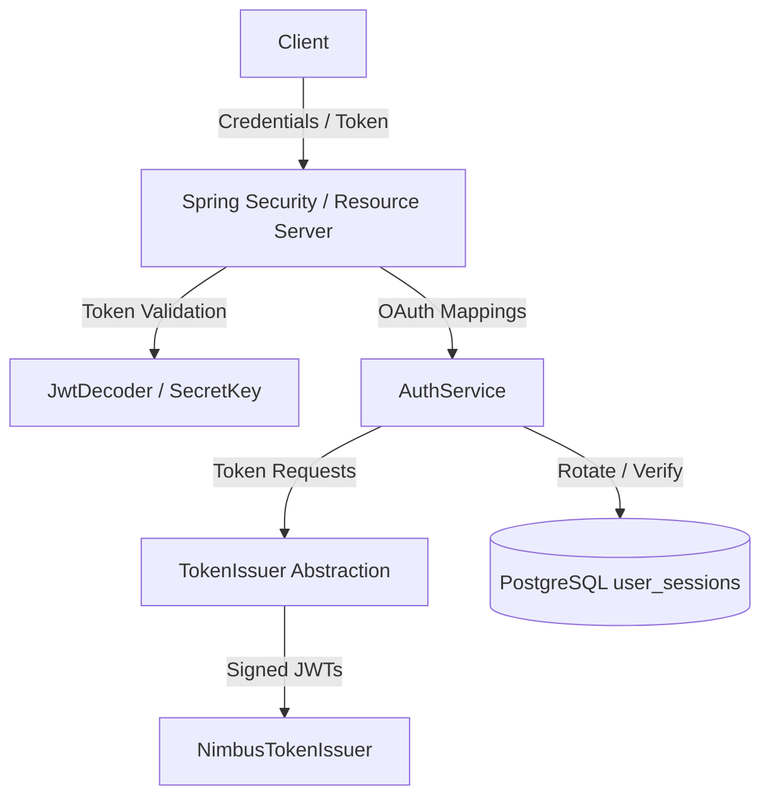

# ADR 007: Identity, Authentication & Session Architecture

## Status
Accepted

## Context
Securing the Julius backend requires an extensible, production-ready identity strategy. We must support both local username/password and federated SSO authentication (Google, GitHub) for API endpoints (CLI tools, workers) and browser-based frontends.

## Decision
We implement a decoupled identity architecture built on Spring Security, custom session models, and database-backed audit tracking.

### 1. Spring Security Resource Server Delegation
We delegate JWT signature validation, token decryption, and SecurityContext configuration to Spring Security Resource Server. A custom `BearerTokenResolver` maps tokens received from either `Authorization: Bearer` headers or `access_token` HTTP-only cookies.

### 2. Centralized Token Issuer Abstraction
We define a `TokenIssuer` interface managing both access and refresh token generation. By centralizing token generation, we decouple core authentication logic from specific libraries (e.g. Nimbus) or cloud-hosted IdPs (e.g. Auth0, Keycloak).

### 3. PostgreSQL JSONB Session Metadata
Active user sessions are stored in the database (`user_sessions`). We store client user-agents, device details, and browser attributes under a `client_metadata` JSONB column. PostgreSQL's binary `JSONB` decomposition enables performant indices and structured queries over text formats.

### 4. Federated Account Linking
We automatically link Google and GitHub providers matching verified user email addresses under the same `User` entity to prevent duplicate identities, checking verified email assertions to avoid account hijacking.

### 5. Argon2id Encryption
We select `Argon2PasswordEncoder` for credentials encryption. Argon2id provides superior protection against GPU-assisted brute force attacks compared to BCrypt.

## Consequences
*   The Julius API boundary behaves stateless for validation but maps stateful session invalidation logs in the database.
*   Integrating future OAuth providers requires registering an `OAuth2UserProvider` bean.
