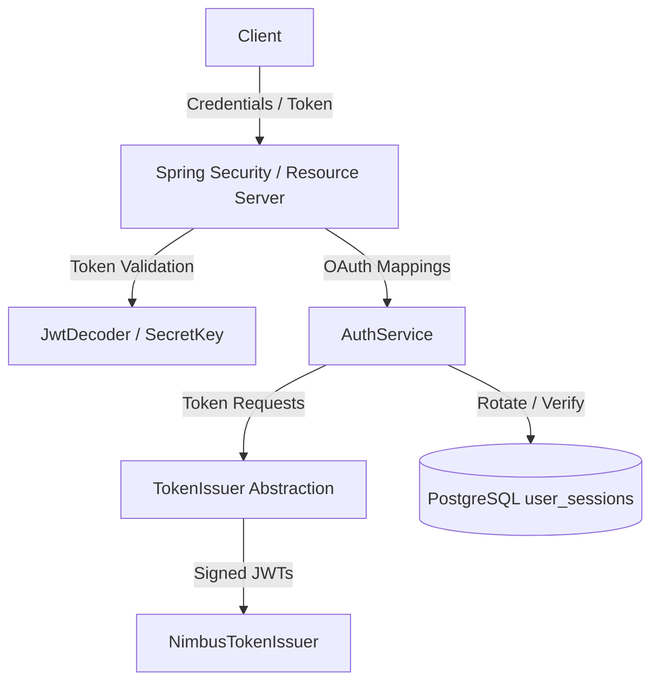

# ADR 007: Identity, Authentication & Session Architecture

## Status
Accepted

## Context
Securing the Julius backend requires an extensible, production-ready identity strategy. We must support both local username/password and federated SSO authentication (Google, GitHub) for API endpoints (CLI tools, workers) and browser-based frontends.

### 1. Spring Security Resource Server Delegation
We delegate JWT signature validation, token decryption, and SecurityContext configuration to Spring Security Resource Server. A custom `BearerTokenResolver` maps tokens received from either `Authorization: Bearer` headers or `access_token` HTTP-only cookies.

### 2. Centralized Token Issuer Abstraction
We define a `TokenIssuer` interface managing both access and refresh token generation. By centralizing token generation, we decouple core authentication logic from specific libraries (e.g. Nimbus) or cloud-hosted IdPs (e.g. Auth0, Keycloak).

### 3. PostgreSQL JSONB Session Metadata
Active user sessions are stored in the database (`user_sessions`). We store client user-agents, device details, and browser attributes under a `client_metadata` JSONB column. PostgreSQL's binary `JSONB` decomposition enables performant indices and structured queries over text formats.

### 4. Federated Account Linking
We automatically link Google and GitHub providers matching verified user email addresses under the same `User` entity to prevent duplicate identities, checking verified email assertions to avoid account hijacking.

### 5. Argon2id Encryption
We select `Argon2PasswordEncoder` for credentials encryption. Argon2id provides superior protection against GPU-assisted brute force attacks compared to BCrypt.

---

## Future JWT Signing-Key Rotation Strategy (Design Only)

To support seamless cryptographic key rotation for JWT signing without causing downtime or invalidating existing sessions, Julius will adopt the JSON Web Key Set (JWKS) architecture:

1.  **Key ID (`kid`) Mapping:**
    *   Every issued access token JWT will include a key identifier (`kid`) claim in its JOSE header.
    *   `kid` maps to the specific key version used to sign the payload.
2.  **Key Lifecycle States:**
    *   *Active:* The key used to sign all *new* outgoing access tokens.
    *   *Next:* Pre-generated key stored in the cluster, not yet used for signing but ready for deployment.
    *   *Retired (Grace Period):* A previously active key that is no longer used for signing but is kept on the verifier list to validate unexpired tokens.
3.  **JWKS Endpoint:**
    *   The backend will expose a public endpoint `/oauth2/jwks` returning the active public keys list (excluding private credentials).
    *   Resource servers (such as isolated background workers) parse the `kid` header from incoming tokens, query `/oauth2/jwks` to resolve the corresponding verification key, and cache the set to minimize network latency.
4.  **Key Replacement Execution:**
    *   During rotation: promote "Next" to "Active", demote "Active" to "Retired", and seed a new key as "Next". Since "Retired" remains valid for signature checks until the max JWT lifespan has expired (e.g., 15 minutes), existing clients remain fully authenticated.
