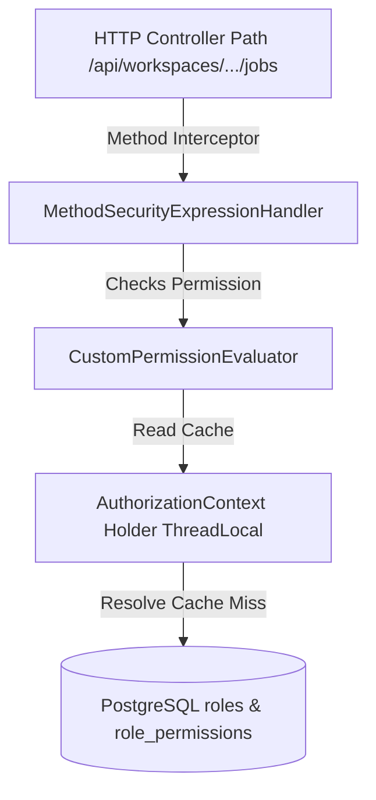

# ADR 008: Multi-Tenancy & Normalized Authorization Architecture

## Status
Accepted

## Context
Securing a scaling SaaS application requires segregating resources into distinct Organization boundaries, nested Workspace environments, and clear, granular permission scopes. We need to design an access verification engine that mitigates N+1 database bottlenecks, enforces IDOR protection across path boundaries, and easily evolves to support dynamic enterprise custom roles.

## Decision
We implement a resource-oriented multi-tenancy hierarchy mapped through normalized relational tables and secured via Spring Security Method annotations with request-scoped caching.

### 1. Resource-Oriented Routing
We expose standard URL mapping structures where resource context is defined natively inside target paths (e.g. `/api/workspaces/{workspaceId}/jobs`). Context headers (like `X-Workspace-Id`) are supported only as helper properties for internal calls or SDK integrations.

### 2. Normalized Roles and Mapping Schemas
To ensure seamless future extension for custom roles without modifying database schemas:
*   We seed distinct roles in the centralized `roles` table (e.g., `ROLE_ORG_OWNER`, `ROLE_WORKSPACE_ADMIN`).
*   We map granular permissions to roles dynamically using a join table `role_permissions` (`role_id`, `permission`).
*   Memberships refer to `role_id` rather than hardcoding static role strings, enabling users to customize permissions per role by updating relational rows.

### 3. Request-Scoped ThreadLocal Permissions Cache
To eliminate redundant database reads, an intercepting `AuthorizationContextFilter` registers an `AuthorizationContext` container on the request thread. The evaluator lazily loads permission scopes on the first check, caching the result. Subsequent evaluations in the same request complete in $O(1)$ time with zero extra database calls.

### 4. Timestamp-based Soft Deletes
We replace boolean flags with a nullable `deleted_at TIMESTAMP` timestamp. This preserves transactional audit timelines, enables granular data recovery, and supports automated scheduled garbage collection cleanups.

## Consequences
*   Adding or altering role scopes is managed strictly through seeding or mapping changes in `role_permissions`.
*   All controllers exposing workspace resources must validate paths using Spring Method Security: `@PreAuthorize("hasPermission(#workspaceId, 'WORKSPACE', 'permission.name')")`.
