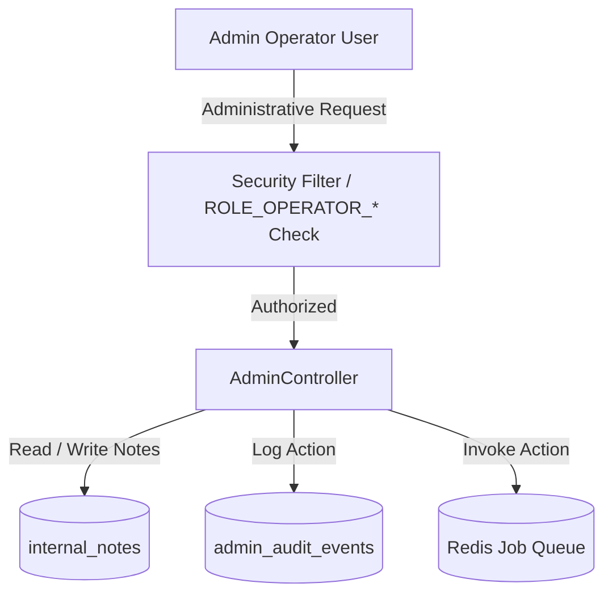

# ADR 009: Enterprise Admin Operations & Diagnostics Platform

## Status
Accepted

## Context
Operators and customer support engineers require high-frequency diagnostic insights and troubleshooting controls without accessing system database consoles directly. We need to construct a segregated administration API path (`/api/admin/**`) containing operational telemetry, global entity searches, private internal logs, and intervention actions.

## Decision
We implement a dedicated administrative API suite secured with exclusive operational roles, supporting unified searches, timeline traversals, and staff-only internal notes.

### 1. Isolated Role Mappings
We establish administrative roles (`ROLE_OPERATOR_SUPER_ADMIN`, `ROLE_OPERATOR_DEVELOPER`, `ROLE_OPERATOR_SUPPORT`, `ROLE_OPERATOR_AUDITOR`) that are completely separate from customer role lists. These roles validate path authorization parameters.

### 2. Polymorphic Global Search
We expose a centralized endpoint `GET /api/admin/search?q={query}` querying users, organizations, workspaces, and jobs simultaneously.

### 3. Chronological Timelines & Private Internal Notes
*   **Timelines:** Users and Organizations map lifecycle logs chronologically (creation dates, login audit footprints, membership activations).
*   **Internal Notes:** Staff can attach private notes to users, organizations, and workspaces. These are kept in an isolated table `internal_notes` and never returned through customer APIs.

### 4. Direct Support Interventions
Operators can trigger job retries and cancellations directly. Retrying a job resets status variables and submits a new task into the queue runner.

## Consequences
*   Administrative actions are fully audited inside `admin_audit_events`.
*   Standard workspace customers are rejected with HTTP 403 when hitting `/api/admin/**` endpoints.
