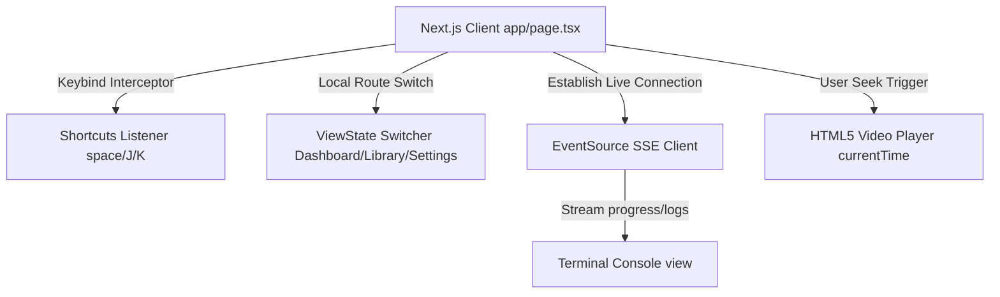

# ADR 010: Client Web Application Design & Theme Architecture

## Status
Accepted

## Context
The customer platform requires an immersive, high-frequency dashboard environment carrying video player frames, live log stream terminals, multi-device active sessions lists, and workspace settings selectors. We need to construct a highly performant, type-safe single-page routing engine inside Next.js that minimizes full-page layout rehydration overhead.

## Decision
We implement a unified, state-driven client-side routing model styled with responsive custom CSS variables and connected to real-time backend updates via EventSource listeners.

### 1. State-Driven Unified Router
We consolidate core navigation nodes (Dashboard, Create Job, Job Details, Library, Settings) behind a fast client-side View State machine (`LANDING` | `AUTH` | `ONBOARDING` | `DASHBOARD` | `SETTINGS`). This prevents network reload latency and maintains connection states.

### 2. Custom CSS Variable Theme
We style the dashboard using pure Vanilla CSS tokens, establishing a custom "Dark Tech" palette:
*   `--bg-primary: #08090A` (deep carbon black)
*   `--accent-primary: #10B981` (emerald active status indicators)
*    Outfit/Inter typeface bindings for wide screen headings.

### 3. Click-Seeking Transcripts & Shortcuts
To maximize highlight editing speeds:
*   We render clip transcript outputs as word-level `` pills mapping absolute audio timestamp counts. Clicking a word seeks the HTML5 player time instantly.
*   We register keyboard shortcut listeners: `J` / `K` for seeking back/forward, `Space` for play/pause toggle, and `Cmd+K` for global command palette overlay dialogs.

### 4. Real-time EventSource Listeners
We stream worker progress outputs directly using standard EventSource SSE listeners. This updates timeline milestones and appends log rows to simulated log console streams.

## Consequences
*   The entire customer experience compiles to static production-ready bundles.
*   Standard HTTP API integrations route through a type-safe `apiClient.ts` class.
