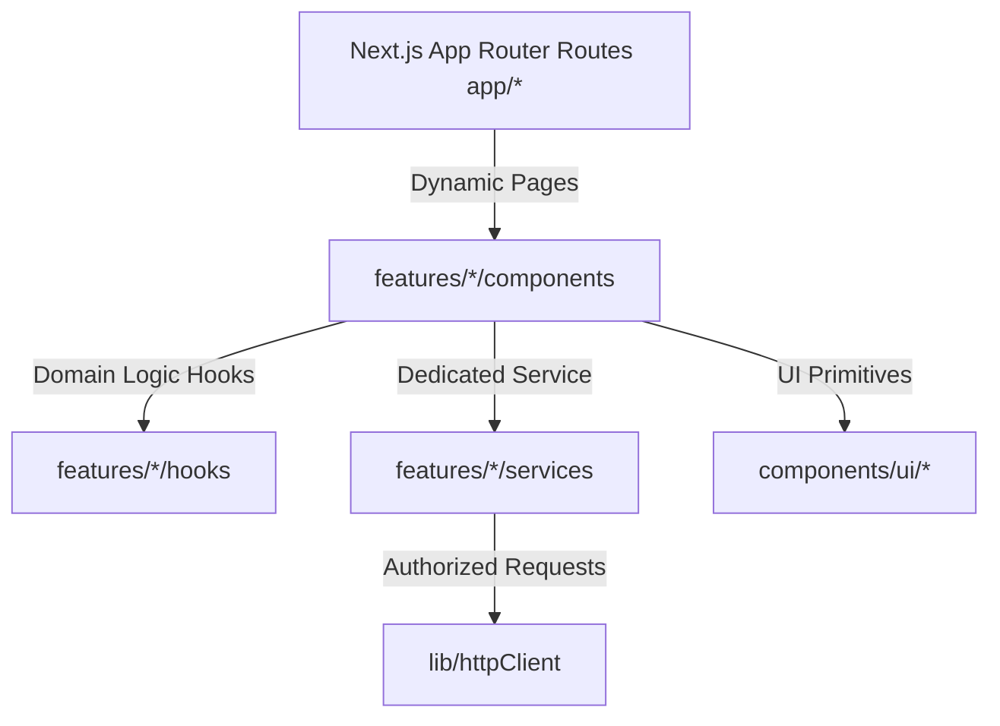

# ADR 011: Business-Feature Sliced Web Application Architecture

## Status
Accepted

## Context
Securing a fast, maintainable SaaS frontend requires segregating components, context models, and API adapters into discrete business feature scopes. The legacy single-file MVP layout is prone to merge conflicts, loading delays, and state pollution.

## Decision
We refactor the Julius customer platform into a business-feature-oriented Next.js App Router folder architecture.

### 1. Business Features Segregation
We organize the frontend workspace around a root `features/` directory containing dedicated domain modules:
*   `auth`: login/register actions and user sessions.
*   `jobs`: submissions, retries, and cancellation services.
*   `clips`: highlight grids, previews, and transcript seekers.
*   `admin`: operational search indexing and staff-notes Jpa mappings.

### 2. UI Primitives Segregation (`components/ui`)
We isolate primitive components (e.g. `Button`, `Input`, `Card`) inside `components/ui/` to ensure layout styles consistency.

### 3. Dedicated Domain Services
We replace the single `apiClient.ts` with feature-specific service layers (`authService.ts`, `jobsService.ts`, `clipsService.ts`, `adminService.ts`) communicating through a centralized `lib/httpClient.ts` base fetch client.

### 4. App Router Support Files
We introduce standard Next.js support conventions:
*   `loading.tsx`: Renders custom shimmer status grids during data retrieval.
*   `error.tsx` / `global-error.tsx`: Enforces React Error Boundary recovery dialogs.
*   `not-found.tsx`: Renders custom 404 sheets for restricted paths.

## Consequences
*   Sub-views are navigated via standard Next.js path links.
*   Code maintenance complexity drops as developers edit files scoped only to their relevant feature domain.
