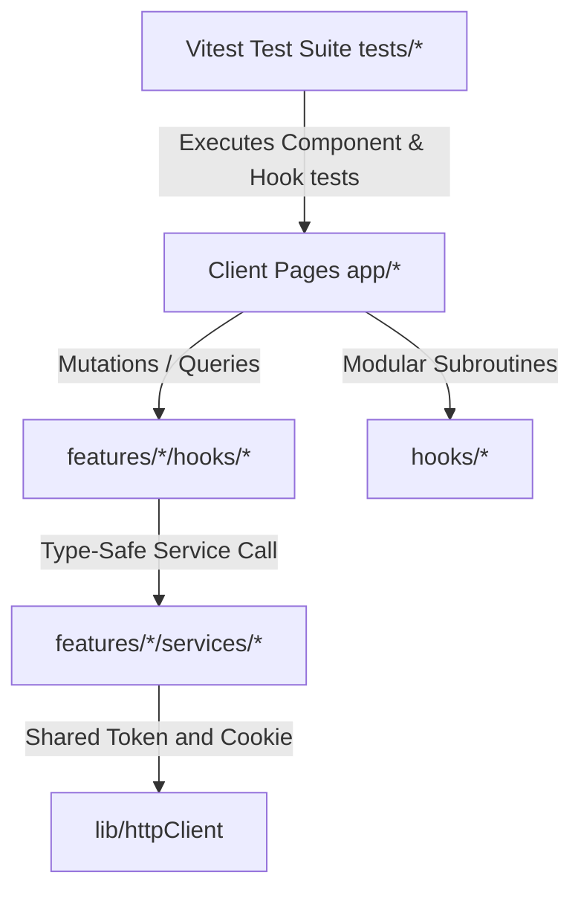

# ADR 012: Frontend Quality Hardening & Testing Architecture

## Status
Accepted

## Context
Deploying an enterprise-grade client workspace requires bulletproof type safety, asynchronous state query lifecycle management, explicit route authorization checks, and a robust frontend test suite (unit, integration, and E2E simulation).

## Decision
We enforce a hardened engineering framework across the Julius customer web application:

### 1. TanStack Query Integration
All asynchronous actions (data loading, query updates, session revocations, and job creations) are migrated from standard `fetch` lifecycle wrappers into feature-sliced react-query hooks:
*   `useLogin()`, `useRegister()`, `useSessions()`, `useRevokeSession()`.
*   `useCreateJob()`, `useRetryJob()`, `useCancelJob()`.
*   `useJobClips()`.
*   `useAiMetrics()`, `useQueueMetrics()`, `useInternalNotes()`, `useAddNote()`.

### 2. Custom React Hooks
Interactive side-effects are decoupled from JSX page controllers into pure custom hooks:
*   `useEventSource`: coordinates SSE logs parser streams.
*   `useKeyboardShortcuts`: captures global hotkeys triggers.
*   `useAuthGuard`: performs client-side token assertions.
*   `useNotification`: handles float-toast status banners.
*   `useCurrentUser`: handles localStorage profile updates.

### 3. Server-Readable Middleware Route Protection
Authentication redirects are enforced inside `middleware.ts`. When users authenticate, the token is written to an `access_token` cookie, which Next.js middleware reads to redirect unauthorized attempts targeting `/dashboard` back to `/login`.

### 4. Testing Framework
We configure a lightweight testing suite using Vitest and JSDOM:
*   `tests/components`: Unit tests rendering ui primitives.
*   `tests/hooks`: Unit tests checking custom React hook state mutations.
*   `tests/integration`: Validating form setups on root views.
*   `tests/e2e`: Simulates input entries and route switches on job creation screens.

## Consequences
*   Zero compiler type assertions (`any`) are allowed.
*   Next.js middleware enforces instant server-readable redirects before client code hydrates.
*   No styling or visual behavior is altered.
