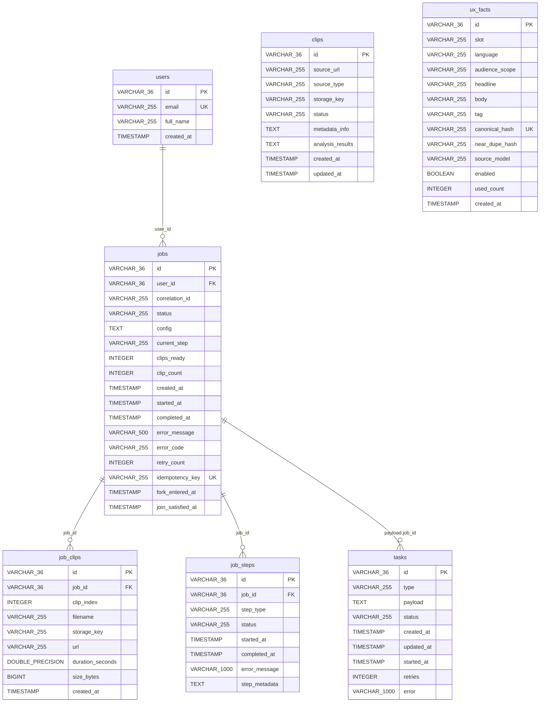

# Julius — Database Schema

## Overview

Julius uses PostgreSQL 16 as its primary database, managed by [Flyway](https://flywaydb.org/) versioned migrations. Hibernate runs in `validate` mode — it verifies the schema at startup but never modifies it.

## Entity-Relationship Diagram

## Table Details

### `users`
User accounts. Referenced by `jobs.user_id` (string FK, no DB-level constraint).

### `jobs`
Central pipeline job entity. Tracks status through `PENDING → PROCESSING → COMPLETED/FAILED/CANCELLED`.

| Index | Columns |
|---|---|
| `idx_jobs_user_id` | `user_id` |
| `idx_jobs_correlation_id` | `correlation_id` |
| `idx_jobs_status` | `status` |
| `idx_jobs_created_at` | `created_at` |

### `tasks`
Pipeline task queue. Used by `DbQueue` with `FOR UPDATE SKIP LOCKED` for concurrent worker claiming. Status enum: `PENDING`, `PROCESSING`, `COMPLETED`, `FAILED`, `CANCELLED`. Type enum: `DOWNLOAD`, `DOWNLOAD_VIDEO`, `INGEST`, `TRANSCRIBE`, `ANALYZE`, `CUT`, `LAYOUT`, `SMART_RENDER`.

### `job_clips`
Output artifacts produced by completed jobs. Each row represents a rendered clip file.

| Constraint | Columns |
|---|---|
| `uq_job_clips_job_id_clip_index` | `(job_id, clip_index)` UNIQUE |
| `uq_job_clips_job_id_filename` | `(job_id, filename)` UNIQUE |
| `idx_job_clips_job_id` | `job_id` INDEX |

### `job_steps`
Tracks individual pipeline step execution within a job.

| Constraint | Columns |
|---|---|
| `uq_job_steps_job_id_step_type` | `(job_id, step_type)` UNIQUE |
| `idx_job_steps_job_id` | `job_id` INDEX |

### `clips`
Source media catalog (scaffolding for future media library feature). **Not actively used** by any service, controller, or worker in the current codebase. The table is created in database schema migration V1 for forward compatibility, but the unused Java `Clip` entity and `ClipRepository` have been removed to keep the active code footprint clean.

### `ux_facts`
Content snippets displayed during processing wait times.

| Index | Columns |
|---|---|
| `idx_ux_facts_slot` | `slot` |
| `idx_ux_facts_language` | `language` |
| `idx_ux_facts_audience_scope` | `audience_scope` |
| `idx_ux_facts_enabled` | `enabled` |
| `idx_ux_facts_created_at` | `created_at` |

## JSON Columns

Several columns store serialized JSON as `TEXT`:

| Table | Column | Converter | Java Type |
|---|---|---|---|
| `jobs` | `config` | `JobConfigConverter` | `JobConfig` |
| `tasks` | `payload` | `MapJsonConverter` | `Map<String, Object>` |
| `job_steps` | `step_metadata` | `MapJsonConverter` | `Map<String, Object>` |
| `clips` | `metadata_info` | `MapJsonConverter` | `Map<String, Object>` |
| `clips` | `analysis_results` | `MapJsonConverter` | `Map<String, Object>` |

These use standard `TEXT` type (not PostgreSQL `jsonb`) for H2 compatibility.

## Billing & Quota Platform Schema

Introduced in Epic 12, this sub-system implements a true immutable double-entry accounting ledger and a CAS-optimized Quota Engine.

### Billing Tables

#### `billing_plans`
Defines available pricing plans (e.g., Free, Basic, Pro). Tracks Stripe Price API identifiers.

#### `subscriptions`
Binds organizations to billing plans. Enforces subscription lifecycle states: `TRIALING`, `ACTIVE`, `PAST_DUE`, `DISPUTED`, `REFUNDED`, `SUSPENDED`, `CANCELED`. Utilizes optimistic locking version checks.

#### `subscription_state_history`
Maintains an immutable transition log of all subscription status modifications.

#### `billing_journals`
Entry point of double-entry ledger mappings per organization. Links Stripe Customer ID tracking.

#### `billing_accounts`
Ledger accounts under journals (e.g., `Cash`, `Revenue`, `Deferred Revenue`). Accounts are classified into types: `ASSET`, `LIABILITY`, `EQUITY`, `REVENUE`, `EXPENSE`.

#### `billing_transactions`
Atomic transaction events containing description and correlation IDs for replay protection.

#### `billing_journal_entries`
Line-items of debit/credit values. Enforces that sum of DEBIT values equals sum of CREDIT values for every transaction. Amount is specified in positive minor units (cents).

### Quotas & Outbox Tables

#### `quota_usage_snapshots`
Caches usage boundaries and balances per organization/feature. Employs Compare-And-Swap (CAS) optimistic check queries to prevent usage concurrency leaks.

#### `usage_events`
Append-only log of granular billable actions (transcriptions, renders, storage changes). Suitable for time-based partitioning.

#### `outbox_events`
Transactional Outbox table storing outbound events to trigger downstream notifications/syncs reliably.

#### `webhook_idempotency_ledger`
Logs processed Stripe webhook event IDs to prevent duplicate processing.
