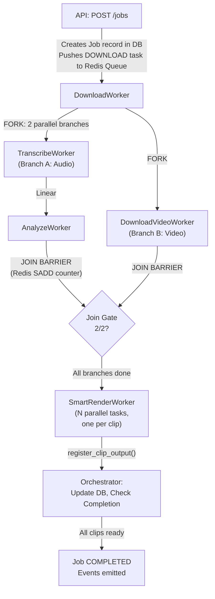

# DOCUMENT X: Seone Architectural Blueprint

> **Purpose**: This document provides a fully decoupled, language-agnostic architectural specification of the Seone system. It is designed to be consumed by a separate LLM tasked with rewriting the entire project in Java (Spring Boot, Redis, PostgreSQL).
>
> **Convention**: All code-level references are to the *original Python source*. Algorithmic steps are written in language-agnostic pseudocode. Java equivalents are suggested parenthetically where disambiguation is needed.

---

## Table of Contents

1. [System Overview & Pipeline Architecture](#1-system-overview--pipeline-architecture)
2. [System Boundaries, Dependencies & Infrastructure](#2-system-boundaries-dependencies--infrastructure)
3. [Data Model & Schema](#3-data-model--schema)
4. [Core Logic & Algorithms](#4-core-logic--algorithms)
5. [Concurrency, Coordination & Queue Architecture](#5-concurrency-coordination--queue-architecture)
6. [API Surface, Auth & WebSocket Contract](#6-api-surface-auth--websocket-contract)
7. [Observability, Error Handling & Resilience](#7-observability-error-handling--resilience)
8. [Rendering Pipeline (rendering_v1)](#8-rendering-pipeline-rendering_v1)

---

## 1. System Overview & Pipeline Architecture

### 1.1 Core Purpose

Seone is an **AI-powered viral video clip extraction and rendering platform**. Given a YouTube URL (or uploaded video file), it:

1. Downloads the source media (audio + video in parallel).
2. Transcribes the audio using OpenAI Whisper (via `faster-whisper` / CTranslate2).
3. Analyzes the transcript using Google Gemini LLM to identify the top-N viral-worthy segments.
4. Renders each identified segment into a production-ready short-form video clip with text overlays, layout templates, and branding.

The system is **multi-tenant** (user-scoped queues, storage, and events), designed for **horizontal scaling** via containerized workers, and uses a **Fork-Join parallel architecture** for maximum throughput.

### 1.2 End-to-End Data Flow



### 1.3 Detailed Pipeline Steps

| Step | TaskType Enum | Worker Class | Input | Output | Storage Side Effects |
|------|---------------|--------------|-------|--------|---------------------|
| 1. Download Audio | `DOWNLOAD` | `DownloadWorker` | `{url, clip_id, user_id}` | `{storage_key, clip_id}` | Saves WAV to `users/{user_id}/library/audios/{clip_id}.wav` |
| 1b. Download Video | `DOWNLOAD_VIDEO` | `DownloadWorker` | `{url, clip_id, user_id}` | `{video_key, clip_id}` | Saves MP4 to `users/{user_id}/library/videos/{clip_id}.mp4` |
| 1c. Ingest (file upload) | `INGEST` | `IngestWorker` | `{file_path, user_id}` | `{video_key, storage_key, clip_id}` | Copies file to library, extracts audio |
| 2. Transcribe | `TRANSCRIBE` | `TranscribeWorker` | `{storage_key, clip_id, user_id}` | `{transcript_key, clip_id}` | Saves JSON to `users/{user_id}/library/cache/{clip_id}_transcript.json` |
| 3. Analyze | `ANALYZE` | `AnalyzeWorker` | `{transcript_key, clip_id, user_id, top_n}` | `{best_clips[], clip_id}` | Saves JSON to `users/{user_id}/library/cache/{clip_id}_analysis.json` |
| 4. Smart Render | `SMART_RENDER` | `SmartRenderWorker` | `{template_ref, time_window, inputs, source_video_key, ...}` | `{final_key, clip_id, index}` | Saves MP4 to `users/{user_id}/jobs/{date}/{job_id}/clips/{filename}.mp4` |
| 4b. Cut (legacy) | `CUT` | `CutWorker` | `{start, end, clip_id, index}` | `{fragment_key, clip_id, index}` | Saves fragment to `temp/fragments/` |
| 4c. Layout (legacy) | `LAYOUT` | `LayoutWorker` | `{fragment_key, clip_id, template_ref}` | `{final_key, clip_id}` | Saves clip to job dir |

### 1.4 Recipe System

The orchestrator uses a **Recipe** dictionary to define the linear/DAG flow for a given job type:

```
RECIPES = {
    "viral_clips_default": [DOWNLOAD, TRANSCRIBE, ANALYZE, CUT],
    "viral_clips_with_layout": [DOWNLOAD, TRANSCRIBE, ANALYZE, CUT, LAYOUT]
}
```

> **Java mapping**: This maps to an enum-keyed `Map<String, List<TaskType>>` or a dedicated `Recipe` configuration class. The recipe name is stored in the task's `payload.recipe` field.

### 1.5 The Fork-Join Architecture

After `DOWNLOAD` completes:
- **Branch A**: `TRANSCRIBE` → `ANALYZE` (CPU/GPU bound, linear)
- **Branch B**: `DOWNLOAD_VIDEO` (I/O bound, runs in parallel)

The **Join Barrier** uses a Redis Set (`SADD`) keyed by `seone:{user_id}:join:{job_id}:smart_render_prep`. Each branch adds its `task_type` value to the set. When `SCARD` returns 2, the barrier is satisfied, and N `SMART_RENDER` tasks are enqueued (one per identified clip).

**Critical Idempotency**: The use of `SADD` (set-add) instead of `INCR` prevents double-counting on retries. A task can only contribute its type once.

---

## 2. System Boundaries, Dependencies & Infrastructure

### 2.1 External Dependencies

| Dependency | Purpose | Python Package/Tool | Java Equivalent |
|-----------|---------|-------------------|-----------------|
| **Redis** | Task queuing, join barriers, locking, event streaming, KEDA signals | `redis-py` | Lettuce / Jedis |
| **PostgreSQL** | Job/Clip/User persistence, task queue fallback | `SQLAlchemy` + `psycopg2` | Spring Data JPA / Hibernate |
| **SQLite** | Local development DB fallback | `SQLAlchemy` | H2 / SQLite JDBC |
| **Google Gemini** | LLM-based transcript analysis and viral clip identification | `google-genai` SDK | Google Gemini Java SDK |
| **faster-whisper** | Speech-to-text transcription (CTranslate2 backend) | `faster-whisper` | **Process-level**: Call faster-whisper via subprocess or gRPC sidecar |
| **FFmpeg** | Video cutting, rendering, overlay composition | `subprocess` calls | `ProcessBuilder` calls |
| **ffprobe** | Video metadata extraction (dimensions, fps, duration) | `subprocess` calls | `ProcessBuilder` calls |
| **yt-dlp** | YouTube/video download, metadata extraction | `yt-dlp` Python package | Call yt-dlp binary via `ProcessBuilder` |
| **Pillow (PIL)** | Image validation, text overlay rasterization | `Pillow` | Java AWT / `javax.imageio` |
| **Google Cloud Storage** | Cloud blob storage (production) | `google-cloud-storage` | `google-cloud-storage` Java SDK |
| **Azure Blob Storage** | Alternative cloud storage | `azure-storage-blob` | Azure Storage Java SDK |
| **Firebase Admin** | Custom token generation for frontend template assets | `firebase-admin` | Firebase Admin Java SDK |
| **Google OAuth2** | ID token verification for login | `google-auth` | Google Auth Library for Java |
| **python-jose** | JWT creation and validation | `python-jose[cryptography]` | `jjwt` or `nimbus-jose-jwt` |
| **FastAPI** | HTTP API framework | `fastapi` + `uvicorn` | Spring Boot WebFlux / MVC |
| **Pydantic** | Schema validation, settings management | `pydantic` + `pydantic-settings` | Jakarta Bean Validation / Spring `@ConfigurationProperties` |
| **json-repair** | LLM JSON output repair | `json_repair` | Custom JSON sanitizer or `org.json` lenient parsing |
| **Node.js** | YouTube challenge solver runtime (yt-dlp dependency) | System binary | System binary |

### 2.2 Containerization

The system deploys as **two separate Docker images**:

#### Worker Image (`Dockerfile`)
- **Base**: `nvidia/cuda:12.1.1-cudnn8-runtime-ubuntu22.04`
- **System packages**: `ffmpeg`, `python3.11`, `nodejs`, `npm`
- **Python packages**: Full `requirements.txt` (includes `faster-whisper`, `torch`, `yt-dlp`, etc.)
- **Entrypoint**: `python run_worker.py --role <role>`
- **Health check**: Built-in HTTP health server on `$PORT` (default 8080)
- **Roles**: `all`, `downloader`, `transcriber`, `editor` (comma-separated)

#### API Image (`Dockerfile.api`)
- **Base**: Standard Python image (no CUDA)
- **Python packages**: `requirements-api.txt` (FastAPI, SQLAlchemy, Redis, etc. — no Whisper/torch)
- **Entrypoint**: `uvicorn src.api.main:app --host 0.0.0.0 --port 8080`

### 2.3 Environment Variables (Complete Registry)

Source: [config.py](file:///e:/Code/Seone-Automation-main%20(2)/Seone-Automation-main/src/core/config.py)

| Variable | Type | Default | Description |
|----------|------|---------|-------------|
| `IO_WORKERS` | int | 8 | Thread pool size for I/O tasks (download/upload) |
| `CPU_WORKERS` | int | 2 | Thread pool size for CPU tasks (rendering) |
| `GPU_WORKERS` | int | 1 | Thread pool size for GPU tasks (transcription) |
| `REDIS_URL` | str | `redis://localhost:6379/0` | Redis connection URL |
| `DATABASE_URL` | str | `sqlite:///data/db/seone.db` | Database connection URL (auto-fixes `postgres://` → `postgresql://`) |
| `STORAGE_BACKEND` | str | `local` | Storage provider: `local`, `gcs`, `azure` |
| `GCS_BUCKET_NAME` | str | null | Google Cloud Storage bucket name |
| `AZURE_STORAGE_CONNECTION_STRING` | str | null | Azure Blob Storage connection string |
| `AZURE_CONTAINER_NAME` | str | `seone-data` | Azure container name |
| `STORAGE_SAS_EXPIRY` | int | 604800 | Signed URL expiry in seconds (1 week) |
| `GOOGLE_API_KEY` | str | null | Google Gemini API key |
| `GEMINI_MODEL` | str | `gemini-3-flash-preview` | Gemini model name for analysis |
| `ENABLE_ISOLATED_QUEUES` | bool | true | Multi-tenant queue isolation |
| `ENABLE_STRICT_AUTH` | bool | *required* | Must be explicitly set; no default |
| `JWT_SECRET_KEY` | str | `dev_secret` | JWT signing secret |
| `GOOGLE_CLIENT_ID` | str | null | Google OAuth2 client ID |
| `ALLOWED_EMAIL_DOMAINS` | str | `creativefuel.io,sarcasm.co` | Comma-separated allowed email domains |
| `WHISPER_MODEL` | str | `deepdml/faster-whisper-large-v3-turbo-ct2` | Whisper model ID |
| `YTDLP_FORMAT` | str | `bestvideo[height<=720]...` | yt-dlp format selection string |
| `GCS_COOKIES_PATH` | str | null | GCS URI to YouTube cookies file |
| `DLQ_MAX_LENGTH` | int | 10000 | Max Dead Letter Queue entries |
| `EVENT_STREAM_MAXLEN` | int | 20000 | Max Redis Stream events per job |
| `STALE_PROCESSING_THRESHOLD_SECONDS` | int | 3600 | Janitor stuck-task threshold |
| `WS_STREAMS_ENABLED` | bool | true | Enable Redis Streams for WebSocket |
| `WS_LEGACY_PUBSUB_FALLBACK` | bool | true | Enable legacy Pub/Sub fallback |
| `EVENT_PUBLISH_LEGACY_CHANNELS` | bool | true | Dual-publish to legacy Pub/Sub |
| `JOB_MAX_ACTIVE_PER_USER` | int | 3 | Max concurrent processing jobs per user |
| `JOB_MAX_QUEUED_PER_USER` | int | 10 | Max queued jobs per user |
| `QUEUE_WARM_HOLD_SECONDS` | int | 0 | Intake job hold delay |
| `QUEUE_EARLY_RELEASE_MIN_JOBS` | int | 1 | Early release threshold for held jobs |
| `ALLOW_TEMPLATE_FILESYSTEM_FALLBACK` | bool | false | Allow local filesystem template fallback |
| `FONT_CATALOG_PATH` | str | null | Path to built-in font catalog JSON |

### 2.4 Storage Architecture

The `StorageProvider` is an abstract interface with these implementations:

| Implementation | Backend | Class |
|---------------|---------|-------|
| `LocalFileStorage` | Local disk (`data/`) | `src.core.storage.local` |
| `GCSStorageProvider` | Google Cloud Storage | `src.core.storage.gcs_storage` |
| `AzureStorageProvider` | Azure Blob Storage | `src.core.storage.azure_storage` |

**Abstract Interface** (`StorageProvider`):
```
METHODS:
  save(data: bytes|BinaryIO, key: string, content_type?: string) → string
  get(key: string) → bytes
  get_stream(key: string) → BinaryIO
  exists(key: string) → boolean
  delete(key: string) → void
  generate_url(key: string) → string          // Local returns absolute path; cloud returns internal URL
  generate_signed_url(key: string, expiration: int) → string  // Cloud returns signed URL
  generate_access_url(key: string, expiration: int) → string  // Canonical frontend URL
  download_to_file(key: string, local_path: string) → void   // Streaming download
  normalize_key(key: string) → string          // Strips "data/" prefix, normalizes slashes
  get_metadata(key: string) → dict
  list(prefix: string) → list
```

**StorageManager** — Higher-level key routing with multi-tenant path resolution:
```
KEY PATTERNS:
  Audio:      users/{user_id}/library/audios/{clip_id}.wav
  Video:      users/{user_id}/library/videos/{clip_id}.mp4
  Transcript: users/{user_id}/library/cache/{clip_id}_transcript.json
  Analysis:   users/{user_id}/library/cache/{clip_id}_analysis.json
  Job output: users/{user_id}/jobs/{YYYY-MM-DD}/{job_id}/clips/{filename}.mp4

LEGACY FALLBACK (_resolve_key algorithm):
  1. Check tenant path: users/{user_id}/{legacy_path}
  2. Check legacy path: {legacy_path}  (e.g., library/videos/{id}.mp4)
  3. Return tenant path for new writes
```

### 2.5 Infrastructure Singletons

Source: [infra.py](file:///e:/Code/Seone-Automation-main%20(2)/Seone-Automation-main/src/core/infra.py)

The `InfraContainer` provides process-scoped, thread-safe singletons via double-checked locking:

- `get_storage_manager()` → Lazily creates a single `StorageManager` instance.
- `get_redis_client()` → Lazily creates a single synchronous Redis client (`decode_responses=False`).

> **Java mapping**: Use `@Singleton` beans in Spring (`@Bean` with default scope) or a `@Component` with `@Lazy`.

**Critical Note**: Three distinct Redis client types exist:
1. **Sync binary client** (`infra.py`): `decode_responses=False` — for binary blob operations.
2. **Sync string client** (`redis_queue.py`): `decode_responses=True` — for queue operations.
3. **Async client** (`websocket.py`): For WebSocket Pub/Sub listeners.

---

## 3. Data Model & Schema

### 3.1 Database Tables

Source: [models.py](file:///e:/Code/Seone-Automation-main%20(2)/Seone-Automation-main/src/core/database/models.py)

#### `users` Table
```sql
CREATE TABLE users (
    id          VARCHAR PRIMARY KEY DEFAULT uuid4(),
    email       VARCHAR NOT NULL UNIQUE,
    full_name   VARCHAR,
    created_at  TIMESTAMP DEFAULT now()
);
```

#### `jobs` Table
```sql
CREATE TABLE jobs (
    id                VARCHAR PRIMARY KEY DEFAULT uuid4(),
    user_id           VARCHAR REFERENCES users(id),  -- nullable, indexed
    correlation_id    VARCHAR NOT NULL,               -- indexed (the "Golden Thread")
    status            ENUM('pending','processing','completed','failed','cancelled') DEFAULT 'pending',  -- indexed
    config            JSON NOT NULL DEFAULT '{}',
    current_step      VARCHAR,                        -- e.g., "download", "transcribe"
    clips_ready       INTEGER DEFAULT 0,              -- denormalized count
    clip_count        INTEGER DEFAULT 1,              -- expected total
    created_at        TIMESTAMP DEFAULT now(),         -- indexed
    started_at        TIMESTAMP,
    completed_at      TIMESTAMP,
    error_message     VARCHAR,
    error_code        VARCHAR,
    retry_count       INTEGER DEFAULT 0,
    idempotency_key   VARCHAR UNIQUE,
    fork_entered_at   TIMESTAMP,                      -- set when fork begins
    join_satisfied_at TIMESTAMP                       -- set when join barrier releases
);
```

**`config` JSON structure** (stored in the `config` column):
```json
{
    "url": "https://youtube.com/watch?v=...",
    "count": 5,
    "min_duration": 60,
    "max_duration": 900,
    "template_ref": "chaturnath/v1",
    "language_mode": "auto",
    "copy_language": "en",
    "render_options": {"quality": "standard", "target": {"format": "mp4"}},
    "source_title": "Video Title From YouTube",
    "source_clip_id": "dQw4w9WgXcQ",
    "requested_count": 5
}
```

#### `job_clips` Table
```sql
CREATE TABLE job_clips (
    id              VARCHAR PRIMARY KEY DEFAULT uuid4(),
    job_id          VARCHAR NOT NULL REFERENCES jobs(id),  -- indexed
    clip_index      INTEGER NOT NULL,
    filename        VARCHAR NOT NULL,
    storage_key     VARCHAR,
    url             VARCHAR,
    duration_seconds FLOAT,
    size_bytes      INTEGER,
    created_at      TIMESTAMP DEFAULT now(),
    UNIQUE (job_id, clip_index),    -- idempotency guard
    UNIQUE (job_id, filename)       -- idempotency guard
);
```

#### `job_steps` Table
```sql
CREATE TABLE job_steps (
    id             VARCHAR PRIMARY KEY DEFAULT uuid4(),
    job_id         VARCHAR NOT NULL REFERENCES jobs(id),  -- indexed
    step_type      VARCHAR NOT NULL,  -- e.g., 'download', 'transcribe', 'fork:entered', 'join:smart_render_prep'
    status         VARCHAR NOT NULL DEFAULT 'pending',  -- pending | running | completed | failed | skipped
    started_at     TIMESTAMP,
    completed_at   TIMESTAMP,
    error_message  VARCHAR,
    step_metadata  JSON,
    UNIQUE (job_id, step_type)  -- idempotency guard
);
```

#### `tasks` Table (DBQueue fallback, used only when Redis is unavailable)
```sql
CREATE TABLE tasks (
    id          VARCHAR PRIMARY KEY DEFAULT uuid4(),
    type        VARCHAR NOT NULL,
    payload     JSON DEFAULT '{}',
    status      VARCHAR DEFAULT 'pending',
    created_at  TIMESTAMP DEFAULT now(),
    updated_at  TIMESTAMP DEFAULT now(),
    retries     INTEGER DEFAULT 0,
    error       VARCHAR
);
```

#### `clips` Table (Legacy asset tracking)
```sql
CREATE TABLE clips (
    id              VARCHAR PRIMARY KEY DEFAULT uuid4(),
    source_url      VARCHAR,
    source_type     ENUM('youtube','instagram','direct','other') DEFAULT 'other',
    storage_key     VARCHAR,
    status          ENUM('pending','downloaded','converted','transcribed','failed') DEFAULT 'pending',
    metadata_info   JSON DEFAULT '{}',
    analysis_results JSON DEFAULT '{}',
    created_at      TIMESTAMP DEFAULT now(),
    updated_at      TIMESTAMP DEFAULT now()
);
```

#### `ux_facts` Table (UX micro-content)
```sql
CREATE TABLE ux_facts (
    id              VARCHAR PRIMARY KEY DEFAULT uuid4(),
    slot            VARCHAR NOT NULL,  -- indexed
    language        VARCHAR NOT NULL DEFAULT 'en',  -- indexed
    audience_scope  VARCHAR NOT NULL DEFAULT 'global',  -- indexed
    headline        VARCHAR NOT NULL,
    body            VARCHAR NOT NULL,
    tag             VARCHAR NOT NULL DEFAULT 'Did you know?',
    canonical_hash  VARCHAR NOT NULL UNIQUE,  -- indexed
    near_dupe_hash  VARCHAR NOT NULL,  -- indexed
    source_model    VARCHAR,
    enabled         BOOLEAN NOT NULL DEFAULT true,  -- indexed
    used_count      INTEGER NOT NULL DEFAULT 0,
    created_at      TIMESTAMP DEFAULT now()  -- indexed
);
```

### 3.2 Job State Machine

Source: [job_contract.py](file:///e:/Code/Seone-Automation-main%20(2)/Seone-Automation-main/src/core/contracts/job_contract.py)

```
JobDBStatus Enum:
  PENDING     → Job created, not yet started
  PROCESSING  → At least one task is running
  COMPLETED   → All clips rendered and registered
  FAILED      → Any task failed (fail-fast)
  CANCELLED   → Administratively cancelled
```

**Status Derivation Methods on Job**:
1. `derive_status()`: Derives from timeline fields (error_message, completed_at, started_at).
2. `derive_phase()`: Fine-grained phase from explicit fork/join timestamps:
   - `queued` → `downloading` → `forked` → `rendering` → `completed` / `failed`
3. `to_api_status()`: Maps persisted DB status to public API contract (always returns persisted value).

### 3.3 Task Object Model

Source: [base.py](file:///e:/Code/Seone-Automation-main%20(2)/Seone-Automation-main/src/core/pipeline/base.py)

```
TaskType Enum:
  DOWNLOAD, DOWNLOAD_VIDEO, INGEST, TRANSCRIBE, ANALYZE, CUT, LAYOUT, SMART_RENDER

TaskStatus Enum:
  PENDING, PROCESSING, COMPLETED, FAILED, CANCELLED

Task Object:
  id:         UUID string (auto-generated)
  type:       TaskType enum
  payload:    Dict<String, Any>  // All job context is carried in this payload
  status:     TaskStatus enum
  created_at: float (epoch seconds)
  updated_at: float (epoch seconds)
  started_at: float (epoch seconds, set by worker)
  retries:    int
  error:      string
  user_id:    → payload.get("user_id")  // Property accessor
```

**Payload Convention**: The task payload is the primary vehicle for passing context between pipeline stages. Key fields:
```json
{
    "job_id": "uuid",
    "user_id": "uuid",
    "url": "https://youtube.com/...",
    "clip_id": "dQw4w9WgXcQ",
    "recipe": "viral_clips_with_layout",
    "top_n": 5,
    "count": 5,
    "min_duration": 60,
    "max_duration": 900,
    "language": "hi",
    "copy_language": "en",
    "template_ref": "chaturnath/v1",
    "render_options": {"quality": "standard"},
    "storage_key": "users/uid/library/audios/clip.wav",
    "transcript_key": "users/uid/library/cache/clip_transcript.json",
    "time_window": {"start": 120.5, "end": 245.8},
    "inputs": {"pov_text": "Nobody expected this plot twist"},
    "source_video_key": "users/uid/library/videos/clip.mp4",
    "index": 1,
    "score": 85,
    "job_start_time": 1719936000.0
}
```

---

## 4. Core Logic & Algorithms

### 4.1 YouTube Download & Canonical ID Resolution

Source: [downloader.py](file:///e:/Code/Seone-Automation-main%20(2)/Seone-Automation-main/src/core/downloader.py)

```
ALGORITHM: DownloadWorker.process(task)

1. EXTRACT clip_id from payload
   IF clip_id is null:
     TRY regex extraction: r"(?:v=|\/)([0-9A-Za-z_-]{11}).*"
     FALLBACK: MD5(url)[:12]

2. PROBE for canonical ID (before acquiring lock):
   IF is_video_task: probe = downloader.probe_video(url)
   ELSE: probe = downloader.probe_audio(url)
   
   canonical_id = probe.info["id"]
   IF canonical_id != clip_id:
     clip_id = canonical_id  // Use YouTube's real ID
   
   UPDATE job.config in DB with source_title and source_clip_id

3. ACQUIRE distributed lock:
   lock_key = "seone:{user_id}:lock:download:{audio|video}:{clip_id}"
   STRATEGY: Redis lock with lease (TTL=60s, heartbeat=30s)
   FALLBACK: Process-local threading.Lock if Redis unavailable

4. CHECK library cache:
   storage_key = storage_mgr.get_{audio|video}_key(clip_id, user_id)
   IF storage.exists(storage_key): RETURN cached result

5. DOWNLOAD to temp directory:
   unique_suffix = UUID[:8]
   temp_filename = "{clip_id}_{unique_suffix}"
   
   IF audio mode:
     raw_path = downloader.download_audio(url, filename=temp_filename, probe=probe)
     wav_path = converter.convert_to_wav(raw_path)
     storage.save(wav_path, storage_key)
     CLEANUP: delete raw_path, wav_path
   
   IF video mode:
     temp_video = downloader.download_video(url, filename=temp_filename, probe=probe)
     storage.save(temp_video, storage_key)
     CLEANUP: delete temp_video

6. RETURN {storage_key, clip_id} or {video_key, clip_id}
```

**Cookie Fallback Strategy**:
```
FOR include_cookies IN [True (if cookies exist), False]:
  opts = apply_cookie_mode(ydl_opts, include_cookies)
  opts = apply_runtime_mode(url, opts)  // Adds YouTube challenge solver config
  TRY:
    info = ydl.extract_info(url, download=False)
    IF has_downloadable_media(info): RETURN (info, opts)
  CATCH: log warning, continue to next mode
RAISE last_error
```

**yt-dlp Options** (exact reproduction required):
```
Common Options:
  noplaylist: true
  quiet: true
  force_ipv4: true
  retries: 10
  fragment_retries: 10
  socket_timeout: 30
  extractor_args: {"youtube": ["player_client=android,ios,tv"]}

Audio: format = "bestaudio/bestaudio*/best"
Video: format = settings.YTDLP_FORMAT (excludes AV1 by default)
       merge_output_format = "mp4"

YouTube Challenge Solver:
  js_runtimes: {"node": {}}
  remote_components: ["ejs:github", "ejs:npm"]
```

### 4.2 Transcription & Segment Merging

Source: [transcriber.py](file:///e:/Code/Seone-Automation-main%20(2)/Seone-Automation-main/src/core/transcriber.py)

**CUDA Detection Algorithm** (critical for Java port):
```
1. TRY: cuda_count = ctranslate2.get_cuda_device_count()
   CATCH: cuda_count = 0

2. gpu_hardware_present = false
   IF cuda_count > 0:
     IF torch is available AND torch.cuda.is_available():
       gpu_hardware_present = true
     ELIF torch is NOT available:
       gpu_hardware_present = true  // Trust ctranslate2, but risky

3. IF gpu_hardware_present:
     device = "cuda", compute_type = "int8"
   ELSE:
     device = "cpu", compute_type = "int8"
```

> **Java Note**: Since faster-whisper is Python-only, the Java port must either: (a) call faster-whisper via subprocess/gRPC sidecar, or (b) use OpenAI Whisper Java bindings (whisper.cpp JNI).

**Whisper Transcription Parameters**:
```
model.transcribe(
  audio_path,
  task = "transcribe",
  language = language_or_null,  // null = auto-detect
  beam_size = 1,               // Greedy decoding
  best_of = 1,
  temperature = 0.0,
  condition_on_previous_text = false,
  initial_prompt = null,       // Only set for "translate" task
  vad_filter = true,
  vad_parameters = {min_silence_duration_ms: 500},
  word_timestamps = true       // Always get words for merging
)
```

**Segment Merging Algorithm** (`SegmentMerger.merge()`):
```
CONFIG:
  silence_threshold_ms = 700
  max_segment_duration_s = 10.0
  min_segment_duration_s = 1.0
  punctuation_break = ".!?"

ALGORITHM:
  buffer = {texts: [], words: [], start: null, end: 0}
  merged = []

  FOR EACH segment IN raw_segments:
    IF segment.text is empty: SKIP

    gap_ms = (segment.start - buffer.end) * 1000
    should_break = false

    IF buffer.start is NOT null:
      current_duration = buffer.end - buffer.start

      IF gap_ms > silence_threshold_ms:          should_break = true  // Rule 1: Silence
      ELIF current_duration >= max_segment_duration: should_break = true  // Rule 2: Max duration
      ELIF last_text ends with ".!?" AND current_duration >= min_segment_duration:
                                                  should_break = true  // Rule 3: Punctuation

    IF should_break AND buffer.texts not empty:
      EMIT merged segment from buffer
      RESET buffer

    ACCUMULATE segment into buffer

  EMIT final buffer
```

### 4.3 LLM Analysis (Gemini Integration)

Source: [llm.py](file:///e:/Code/Seone-Automation-main%20(2)/Seone-Automation-main/src/analysis/llm.py), [analyzer.py](file:///e:/Code/Seone-Automation-main%20(2)/Seone-Automation-main/src/analysis/analyzer.py)

**Analysis Flow**:
```
ALGORITHM: ContentAnalyzer.analyze_transcript(transcript_data, top_n, min_duration, max_duration)

1. NORMALIZE segments (handle {start,end} format and {timestamp} format)

2. CALL Gemini LLM (first pass):
   top_clips = gemini.analyze_full_transcript(
     full_text, chunks, min_duration, max_duration, top_n
   )

3. VALIDATE each clip schema:
   REQUIRED fields: start (float), end (float), score (int 0-100),
                    reasoning (string), pov_en (non-empty string), pov_hi (non-empty string)
   REJECT if: start >= end, duration < min_duration, duration > max_duration
   REJECT if: duplicate time window (normalized to 3 decimal places)

4. IF valid_clips.count < top_n:
   RETRY once with accepted_windows exclusion list
   
5. IF still underfilled (0 < count < top_n):
   Proceed with partial results; set partial_reason = "underfilled_after_retry"
   Emit partial_results event to orchestrator

6. RETURN {
     best_clips: [{start, end, score, reasoning, pov_en, pov_hi, text}, ...],
     requested_clips: top_n,
     returned_clips: actual_count,
     partial_results: boolean,
     partial_reason: string | null,
     partial_error: string | null
   }
```

**Gemini Configuration**:
```
Client: genai.Client(api_key=GOOGLE_API_KEY)
Model:  settings.GEMINI_MODEL (default: "gemini-3-flash-preview")
Config: response_mime_type = "application/json"
        response_json_schema = clip_list_schema

JSON Schema:
  type: "array"
  items:
    type: "object"
    properties:
      start: {type: "number"}
      end: {type: "number"}
      score: {type: "integer", minimum: 0, maximum: 100}
      reasoning: {type: "string"}
      pov_en: {type: "string"}
      pov_hi: {type: "string"}
      text: {type: "string"}
    required: [start, end, score, reasoning, pov_en, pov_hi, text]

Rate Limit Delay: 2.0 seconds between calls
```

### 4.4 Sliding Window Selector (Legacy Algorithm)

Source: [algorithms.py](file:///e:/Code/Seone-Automation-main%20(2)/Seone-Automation-main/src/analysis/algorithms.py)

```
ALGORITHM: SlidingWindowSelector.find_top_n_windows(chunks, n)

1. used_indices = empty set
2. FOR i in 1..n:
     best_window = null
     max_avg_score = -1.0
     
     FOR start_idx in 0..len(chunks):
       IF start_idx in used_indices: SKIP
       
       current_duration = 0
       score_sum = 0
       
       FOR end_idx in start_idx..len(chunks):
         IF end_idx in used_indices: BREAK  // Window broken by used chunk
         
         chunk_duration = chunk[end_idx].end - chunk[end_idx].start
         IF current_duration + chunk_duration > max_duration: BREAK
         
         current_duration += chunk_duration
         score_sum += chunk[end_idx].score
         
         IF current_duration >= min_duration:
           avg_score = score_sum / (end_idx - start_idx + 1)
           IF avg_score > max_avg_score:
             UPDATE best_window
     
     IF best_window is null: BREAK
     ADD best_window to results
     MARK chunk_indices as used

3. RETURN top_windows
```

### 4.5 Output Filename Generation

Source: [output_naming.py](file:///e:/Code/Seone-Automation-main%20(2)/Seone-Automation-main/src/core/output_naming.py)

```
ALGORITHM: build_clip_filename(job_id, clip_index, source_title, template_ref)

1. source_slug = ascii_slug(source_title, fallback="untitled-source")
   // NFKD normalize → ASCII only → replace non-alphanumeric with "-" → lowercase
   
2. template_part = template_slug(template_ref)
   // Normalize slashes → ascii_slug(ref.replace("/", "-"), "template")

3. clip_number = max(clip_index, 1)

4. RETURN "clip-{clip_number:02d}_{source_slug}_{template_part}_{job_id[:8]}.mp4"
```

### 4.6 clip_id Recovery Strategy

Source: [workers.py](file:///e:/Code/Seone-Automation-main%20(2)/Seone-Automation-main/src/core/pipeline/workers.py) `ensure_clip_id()`

```
ALGORITHM: ensure_clip_id(task)

1. clip_id = task.payload["clip_id"]
2. IF clip_id is null AND url exists:
     TRY regex: r"(?:v=|\/)([0-9A-Za-z_-]{11}).*"
     IF match: clip_id = match.group(1)
     ELSE: clip_id = MD5(url.encode())[:12]
3. IF clip_id is still null:
     LOG ERROR "clip_id is None and could not be recovered"
4. RETURN clip_id
```

---

## 5. Concurrency, Coordination & Queue Architecture

### 5.1 Queue Provider Abstraction

Source: [base.py](file:///e:/Code/Seone-Automation-main%20(2)/Seone-Automation-main/src/core/pipeline/base.py)

```
INTERFACE QueueProvider:
  push(task: Task) → void
  pop(task_type?: TaskType) → Task | null
  complete(task: Task) → void
  fail(task_id: string, error: string) → void
```

Two implementations exist:

#### 5.1.1 RedisQueue (Production)

Source: [redis_queue.py](file:///e:/Code/Seone-Automation-main%20(2)/Seone-Automation-main/src/core/pipeline/redis_queue.py)

**Redis Key Schema** (Source: [task_repository.py](file:///e:/Code/Seone-Automation-main%20(2)/Seone-Automation-main/src/core/pipeline/task_repository.py)):

| Key Pattern | Type | Purpose |
|------------|------|---------|
| `seone:active_tenants` | Set | Set of active user IDs |
| `seone:task:{task_id}` | Hash | Task payload, user_id, type, timestamps, heartbeat |
| `seone:{user_id}:queue:{task_type}` | List | Per-tenant pending task queue |
| `seone:{user_id}:processing:{task_type}` | List | Per-tenant in-flight task queue |
| `seone:queue:{task_type}` | List | Legacy (non-tenant) pending queue |
| `seone:processing:{task_type}` | List | Legacy in-flight queue |
| `seone:pending_signal:{task_type}` | List | KEDA autoscaler pending signal |
| `seone:processing_signal:{task_type}` | List | KEDA autoscaler processing signal |
| `seone:{user_id}:dlq` | List | Per-tenant Dead Letter Queue |
| `seone:dlq` | List | Global Dead Letter Queue |
| `seone:{user_id}:join:{job_id}:smart_render_prep` | Set | Fork-Join barrier counter |
| `seone:{user_id}:lock:download:{audio\|video}:{clip_id}` | String (Lock) | Download deduplication lock |
| `seone:{user_id}:job:{job_id}:events` | Stream | Durable event stream per job |
| `seone:{user_id}:job:{job_id}:seq` | String (Integer) | Monotonic sequence counter per job |

**Push Algorithm**:
```
ALGORITHM: RedisQueue.push(task)

IF isolated_queues_enabled:
  REQUIRE task.user_id is not null
  
  1. HSET task hash:
     key = "seone:task:{task_id}"
     fields = {payload: JSON(task), user_id, type, created_at, release_at}
     EXPIRE = 604800 (7 days)
  
  2. LPUSH to tenant queue: "seone:{user_id}:queue:{task_type}"
  3. SADD tenant to active set: "seone:active_tenants"
  4. LPUSH to KEDA signal: "seone:pending_signal:{task_type}"

ELSE (legacy mode):
  LPUSH to legacy queue: "seone:queue:{task_type}" with full JSON payload
```

**Pop Algorithm (Fair Multi-Tenant Polling)**:
```
ALGORITHM: RedisQueue.pop(task_type)

1. active_tenants = SMEMBERS "seone:active_tenants"
2. SHUFFLE active_tenants  // Fairness: random order each poll

3. FOR EACH user_id IN active_tenants:
     queue_key = "seone:{user_id}:queue:{task_type}"
     processing_key = "seone:{user_id}:processing:{task_type}"
     
     // WARM HOLD CHECK:
     task_id = PEEK last element of queue
     IF task's release_at > now(): SKIP  // Not yet released
     
     // ATOMIC MOVE:
     task_id = RPOPLPUSH queue_key → processing_key
     IF task_id:
       LREM pending_signal
       LPUSH processing_signal
       RETURN hydrate_task(task_id)

4. TRY legacy fallback queue: "seone:queue:{task_type}"
5. RETURN null
```

**Warm Hold Mechanism**:
- Newly pushed `DOWNLOAD` and `INGEST` tasks have a `release_at` field set to `now() + QUEUE_WARM_HOLD_SECONDS`.
- Tasks are not popped until `release_at` has passed.
- **Early release**: If queue length >= `QUEUE_EARLY_RELEASE_MIN_JOBS`, all held tasks are released immediately.

**Heartbeat**:
```
touch_task_heartbeat(task_id):
  HSET "seone:task:{task_id}" heartbeat_at = time.now()
```

**Failure → DLQ**:
```
ALGORITHM: RedisQueue.fail(task_id, error)

1. READ task hash for user_id and type
2. LREM from processing queue
3. LREM from processing signal
4. Build DLQ entry JSON: {id, error, user_id, job_id, failed_at, failed_at_iso}
5. RPUSH to tenant DLQ: "seone:{user_id}:dlq"  (or global DLQ)
6. LTRIM to DLQ_MAX_LENGTH
7. DELETE task hash
```

#### 5.1.2 DBQueue (Local Development Fallback)

Source: [task_queue.py](file:///e:/Code/Seone-Automation-main%20(2)/Seone-Automation-main/src/core/pipeline/task_queue.py)

Uses the `tasks` SQL table with `SELECT ... FOR UPDATE SKIP LOCKED` for concurrent pop.

### 5.2 Worker Runner & Thread Pool Architecture

Source: [runner.py](file:///e:/Code/Seone-Automation-main%20(2)/Seone-Automation-main/src/core/pipeline/runner.py)

**Role-Based Worker Assignment**:
```
role_map = {
    "downloader":   [DOWNLOAD, DOWNLOAD_VIDEO, INGEST],
    "transcriber":  [TRANSCRIBE],
    "editor":       [CUT, LAYOUT, SMART_RENDER, ANALYZE]
}
```

**Three Independent Thread Pools**:
```
IO Pool:  ThreadPoolExecutor(IO_WORKERS)   → DOWNLOAD, DOWNLOAD_VIDEO, INGEST, ANALYZE
CPU Pool: ThreadPoolExecutor(CPU_WORKERS)  → CUT, LAYOUT
GPU Pool: ThreadPoolExecutor(GPU_WORKERS)  → TRANSCRIBE, SMART_RENDER
```

**Semaphore-Based Backpressure**:
Each pool also has a corresponding `Semaphore` to limit concurrent task execution:
```
semaphores = {
    "io":  Semaphore(IO_WORKERS),
    "cpu": Semaphore(CPU_WORKERS),
    "gpu": Semaphore(GPU_WORKERS)
}
```

**Main Loop Algorithm**:
```
ALGORITHM: WorkerRunner.run(poll_interval=1)

WHILE running:
  found_any = false
  any_acquired = false
  task_types = SHUFFLE(active_task_types)  // Random order each round

  FOR EACH task_type IN task_types:
    sem = semaphores[semaphore_map[task_type]]
    IF NOT sem.acquire(blocking=false): CONTINUE  // Pool full
    
    any_acquired = true
    task = queue.pop(task_type)
    
    IF task:
      found_any = true
      pool = executor_map[task_type]
      pool.submit(_execute_task_with_release, task, sem)
    ELSE:
      sem.release()

  IF NOT found_any: sleep(poll_interval)
```

**Task Execution with Lifecycle Management**:
```
ALGORITHM: _execute_task(task)

1. LOOKUP worker for task.type
2. IF job_id exists:
     orchestrator.set_started_at_atomic(job_id)
     orchestrator.update_current_step(job_id, step_name)
     orchestrator.record_step_start(job_id, step_name)
     event_publisher.emit_step_started(...)

3. START heartbeat thread:
     EVERY 30 seconds: queue.touch_task_heartbeat(task.id)

4. TRY:
     result = worker.process(task)
     record_step_completion(job_id, step_name, "completed")
     emit_step_completed(...)
     
     IF result:
       next_tasks = orchestrator.get_next_tasks(task, result)
       FOR EACH next_task: queue.push(next_task)
     
     queue.complete(task)  // ACK only after downstream scheduling

5. CATCH Exception:
     queue.fail(task.id, error)
     record_step_completion(job_id, step_name, "failed", error)
     orchestrator.mark_job_failed(job_id, error, user_id)
     emit_job_failed(...)

6. FINALLY: stop heartbeat thread
```

### 5.3 Orchestrator — The State Machine Brain

Source: [orchestrator.py](file:///e:/Code/Seone-Automation-main%20(2)/Seone-Automation-main/src/core/pipeline/orchestrator.py)

**Zombie Guard Pattern**: Every orchestrator method that writes state checks for terminal job status first:
```
IF job.status IN [COMPLETED, FAILED, CANCELLED]:
  LOG WARNING "Zombie Guard: Ignoring operation for terminal job"
  RETURN (no-op)
```

**Fork-Join Orchestration** (`get_next_tasks()`):
```
ALGORITHM: get_next_tasks(current_task, result)

// JOIN ZOMBIE GUARD — check before ANY coordination
IF job_id AND job.status is terminal: RETURN []

// FORK: After DOWNLOAD completes
IF current_task.type == DOWNLOAD:
  mark_fork_entered(job_id)
  RETURN [
    Task(TRANSCRIBE, {..., storage_key: result.storage_key}),
    Task(DOWNLOAD_VIDEO, {...})
  ]

// After INGEST (video already in library):
IF current_task.type == INGEST:
  RETURN [Task(TRANSCRIBE, {..., storage_key: result.storage_key})]

// LINEAR: After TRANSCRIBE → ANALYZE
IF current_task.type == TRANSCRIBE:
  RETURN [Task(ANALYZE, {..., transcript_key: result.transcript_key})]

// JOIN BARRIER: After ANALYZE or DOWNLOAD_VIDEO
IF current_task.type IN [ANALYZE, DOWNLOAD_VIDEO]:
  join_key = "seone:{user_id}:join:{job_id}:smart_render_prep"
  
  // Idempotent: SADD prevents double-counting on retry
  SADD join_key, current_task.type.value
  EXPIRE join_key, 3600
  count = SCARD join_key
  
  IF count == 2:
    // JOIN SUCCESS — both branches completed
    mark_join_satisfied(job_id)
    
    // Load analysis results from storage
    analysis_key = storage_mgr.get_analysis_key(clip_id, user_id)
    analysis_data = JSON.parse(storage.get(analysis_key))
    best_clips = analysis_data.best_clips
    
    // Adjust expected count if fewer clips found
    IF 0 < len(best_clips) < requested_count:
      adjust_expected_clip_count(job_id, len(best_clips), requested_count)
    
    // Fan-out: Create N parallel render tasks
    RETURN _create_cut_tasks(current_task, {best_clips})
  ELSE:
    RETURN []  // Wait for other branch

// TERMINAL: After CUT or SMART_RENDER
IF current_task.type IN [CUT, SMART_RENDER]:
  register_clip_output(job_id, clip_info)
  RETURN []
```

**Clip Registration & Job Completion** (`register_clip_output()`):
```
ALGORITHM: register_clip_output(job_id, clip_index, filename, storage_key, ...)

1. ZOMBIE GUARD: Check job is not terminal

2. NORMALIZE storage_key (strip "data/" prefix)
3. GENERATE access URL

4. TRY INSERT JobClip row (UNIQUE constraint on job_id + clip_index)
   CATCH IntegrityError:
     LOG "Clip already exists (retry idempotency)"
     RETURN  // STOP — do not proceed to completion check

5. BUFFER events (emit AFTER DB commit)

6. Count actual clips in DB: clips_count = COUNT(job_clips WHERE job_id)
7. UPDATE job.clips_ready = clips_count

8. expected = job.clip_count or job.config["count"] or 1
9. IF clips_count >= expected:
     // ATOMIC WRITE CONTRACT:
     job.completed_at = now()
     job.status = COMPLETED
     BUFFER completion event
   ELSE:
     BUFFER progress event

10. COMMIT DB

11. EMIT buffered events (AFTER commit — causal ordering)
```

### 5.4 Download Lock Strategy

Source: [workers.py](file:///e:/Code/Seone-Automation-main%20(2)/Seone-Automation-main/src/core/pipeline/workers.py)

```
ALGORITHM: _download_lock_scope(queue, lock_key, ttl=60, heartbeat_interval=30)

1. TRY resolve Redis client from queue or infra singleton
2. IF Redis available:
     TRY:
       ACQUIRE RedisLockLease(lock_key, ttl, heartbeat_interval)
       // Heartbeat thread automatically extends TTL
       YIELD
       RETURN
     CATCH RedisError:
       LOG WARNING, fall through to local lock
3. FALLBACK: Process-local threading.Lock with reference counting
```

### 5.5 Janitor (Stuck Task Recovery)

Source: [janitor.py](file:///e:/Code/Seone-Automation-main%20(2)/Seone-Automation-main/src/core/pipeline/janitor.py)

```
ALGORITHM: clean_stuck_tasks()

1. CHECK DLQ health (global + per-tenant) → email alerts if non-empty

2. SCAN all processing queues (legacy + per-tenant × per-task-type)

3. FOR EACH task in processing queue:
   // Determine age from heartbeat (preferred) or started_at
   last_signal = heartbeat_at or started_at
   age = now - last_signal
   
   IF age <= stuck_threshold: SKIP
   
   LREM task from processing queue
   LREM task from processing signal
   
   IF retry_count < MAX_RETRIES (3):
     INCREMENT retry_count
     REQUEUE to pending queue (RPUSH)
     LPUSH to pending signal
   ELSE:
     MOVE to DLQ (tenant or global)
     LTRIM DLQ to max length
     DELETE task hash
     OPTIONALLY: Mark job as FAILED in DB (if ENABLE_JANITOR_DB_SYNC)
```

---

## 6. API Surface, Auth & WebSocket Contract

### 6.1 HTTP API Endpoints

Source: [main.py](file:///e:/Code/Seone-Automation-main%20(2)/Seone-Automation-main/src/api/main.py), route modules

| Method | Path | Auth | Description |
|--------|------|------|-------------|
| `POST` | `/api/v1/auth/google` | None | Exchange Google ID token for Seone JWT |
| `GET` | `/api/v1/auth/me` | Bearer JWT | Validate session, return user info (structured 401) |
| `POST` | `/api/v1/auth/firebase-token` | Bearer JWT | Get Firebase custom token for template assets |
| `POST` | `/api/v1/auth/dev_login` | None | Dev-only login (disabled in production) |
| `POST` | `/api/v1/jobs` | Bearer JWT | Create a new job |
| `GET` | `/api/v1/jobs` | Bearer JWT | List jobs (paginated, filtered by user) |
| `GET` | `/api/v1/jobs/{job_id}` | Bearer JWT | Get job status with clips |
| `GET` | `/api/v1/jobs/{job_id}/events` | Bearer JWT | Get durable event stream (cursor-based) |
| `POST` | `/api/v1/jobs/{job_id}/preview` | Bearer JWT | Synchronous clip re-render preview |
| `GET` | `/api/v1/jobs/{job_id}/clips/{clip_index}/studio` | Bearer JWT | Load clip studio manifest |
| `PUT` | `/api/v1/jobs/{job_id}/clips/{clip_index}/studio/draft` | Bearer JWT | Save studio draft |
| `POST` | `/api/v1/jobs/{job_id}/clips/{clip_index}/studio/export` | Bearer JWT | Export final clip from studio |
| `POST` | `/api/v1/jobs/{job_id}/clips/{clip_index}/copy-suggestions` | Bearer JWT | Get AI POV text suggestions |
| `GET` | `/api/v1/health` | None | Health check |
| `POST` | `/api/v1/janitor/clean` | Admin | Trigger janitor cleanup |
| `GET` | `/api/v1/ux/facts` | Bearer JWT | Get UX waiting-screen facts |
| `GET` | `/data/{file_path}` | None | Data gateway (streams files from storage) |
| `WS` | `/ws/{job_id}` | Query param `token` | Real-time job event stream |

### 6.2 Job Creation Flow

Source: [routes/jobs.py](file:///e:/Code/Seone-Automation-main%20(2)/Seone-Automation-main/src/api/routes/jobs.py)

**Request Schema** (`JobCreateRequest`):
```json
{
    "url": "https://youtube.com/watch?v=...",
    "min_duration": 60.0,         // REQUIRED, >= 0.1
    "max_duration": 300.0,        // REQUIRED, >= 0.1, >= min_duration
    "count": 5,                   // REQUIRED, > 0
    "template_ref": "chaturnath/v1",  // REQUIRED, non-empty
    "language_mode": "auto",      // REQUIRED: "hi" | "en" | "auto"
    "copy_language": "en",        // REQUIRED: "hi" | "en"
    "render_options": {}          // Optional
}
// extra = "forbid" — no unknown fields allowed
```

**Job Creation Algorithm**:
```
1. VALIDATE request schema (Pydantic)
2. ENFORCE per-user limits:
   active_count = COUNT(jobs WHERE user_id AND status IN [pending, processing])
   IF active_count >= JOB_MAX_ACTIVE_PER_USER: 429 Too Many Requests
   queued_count = COUNT(jobs WHERE user_id AND status = pending)
   IF queued_count >= JOB_MAX_QUEUED_PER_USER: 429 Too Many Requests
3. GENERATE job_id = UUID
4. CREATE Job record in DB with config JSON
5. CREATE DOWNLOAD Task with payload including all config fields
6. PUSH task to Redis queue
7. RETURN {id, status: "pending", ws_url: "/ws/{job_id}?token=..."}
```

### 6.3 Authentication

Source: [dependencies.py](file:///e:/Code/Seone-Automation-main%20(2)/Seone-Automation-main/src/api/dependencies.py), [auth/routes.py](file:///e:/Code/Seone-Automation-main%20(2)/Seone-Automation-main/src/api/auth/routes.py)

**JWT Configuration**:
- Algorithm: `HS256`
- Secret: `JWT_SECRET_KEY` env var (default `dev_secret`)
- Expiry: 480 minutes (8 hours)
- Claims: `{sub: user_id, email: user_email, exp: expiry_timestamp}`

**Auth Flow**:
```
1. Frontend sends Google ID token via POST /auth/google
2. Backend verifies token with google.oauth2.id_token.verify_oauth2_token()
3. Domain enforcement: email must end with allowed domain or be whitelisted
4. Get-or-create User in DB
5. Generate JWT with user_id as "sub" claim
6. Return {access_token, token_type: "bearer", expires_in, user: {id, email, name, role}}
```

**Strict Auth Toggle**:
- `ENABLE_STRICT_AUTH=true`: Full JWT validation on every request.
- `ENABLE_STRICT_AUTH=false`: Dev mode — returns root user without validation.
- **This env var MUST be explicitly set; no default**. Startup fails if missing.

**Structured Error Codes** (only from `/auth/me`):
- `token_missing`: No Authorization header
- `token_expired`: JWT valid but expired
- `token_invalid`: JWT decode failed
- `user_not_found`: JWT valid but user deleted

### 6.4 WebSocket Contract

**Connection**: `WS /ws/{job_id}?token=<jwt>&cursor=<stream_cursor>`

**Event Envelope** (Redis Streams → WebSocket):
```json
{
    "event_id": "uuid",
    "seq": 42,
    "job_id": "uuid",
    "user_id": "uuid",
    "event_type": "step_started|step_completed|clip_ready|progress_update|job_completed|job_failed",
    "timestamp": "2024-01-15T10:30:00.000Z",
    "cursor": "1705312200000-0",
    "step": "transcribe",
    "progress": 75,
    "message": "Transcribing...",
    "payload": {...},
    "trace_id": "task-uuid"
}
```

**Event Types** (EventType enum):
```
JOB_STARTED, STEP_STARTED, STEP_PROGRESS, STEP_COMPLETED,
CLIP_READY, LOG_EMIT, JOB_COMPLETED, JOB_FAILED, PROGRESS_UPDATE
```

### 6.5 UI State Derivation

The API derives a canonical `ui_state` object for frontend rendering:

```
UIJobStatus Enum:
  QUEUED, DOWNLOADING, TRANSCRIBING, ANALYZING, RENDERING, COMPLETED, FAILED

UIJobActiveStep Enum:
  DOWNLOAD, TRANSCRIBE, ANALYZE, SMART_RENDER, COMPLETED, FAILED
```

---

## 7. Observability, Error Handling & Resilience

### 7.1 Event System (Redis Streams + Legacy Pub/Sub)

Source: [events.py](file:///e:/Code/Seone-Automation-main%20(2)/Seone-Automation-main/src/core/events.py)

**Dual-Publish Strategy**:
1. **Primary**: Redis Streams (`XADD`) with monotonic sequence counter (`INCR`).
2. **Legacy**: Pub/Sub channels (for existing WS consumers during migration).

**Stream Key**: `seone:{user_id}:job:{job_id}:events`
**Sequence Key**: `seone:{user_id}:job:{job_id}:seq`
**Legacy Global Channel**: `seone:job_events`
**Legacy Per-Job Channel**: `seone:job:{job_id}:events`

**Publish Algorithm**:
```
ALGORITHM: EventPublisher.publish(job_id, event_type, payload, ...)

1. RESOLVE user_id:
   a. From explicit parameter
   b. From payload["user_id"]
   c. From DB lookup (Job.user_id)
   d. Fallback: "unknown"

2. INCR sequence counter → seq

3. BUILD event envelope: {event_id, seq, job_id, user_id, event_type, timestamp, step, progress, message, payload, trace_id}

4. XADD to stream (maxlen ~ EVENT_STREAM_MAXLEN with approximate trimming)

5. IF publish_legacy_channels:
   PUBLISH to global channel
   PUBLISH to per-job channel

6. LOG metric: event_published_total
```

**Stream Decoding** (`decode_stream_event()`):
- Handles both `bytes` and `str` payloads (sync vs async Redis).
- Parses JSON payload field.
- Normalizes progress to `int | null`.
- Copies `step` into payload if present.

### 7.2 Resilience Policy

Source: [resilience.py](file:///e:/Code/Seone-Automation-main%20(2)/Seone-Automation-main/src/utils/resilience.py)

```
CLASS ResiliencePolicy:
  max_retries: int (default 3)
  base_delay: float (default 1.0s)
  max_delay: float (default 30.0s)

  classify(error) → ErrorCategory:
    TRANSIENT → retry with exponential backoff + jitter
    FATAL → fail immediately, no retry
    QUOTA → wait max_delay then retry

  execute(func):
    WHILE true:
      TRY: return func()
      CATCH:
        attempt += 1
        category = classify(error)
        IF category == FATAL: RAISE
        IF attempt >= max_retries: RAISE
        IF category == QUOTA: sleep(max_delay)
        ELSE: sleep(delay + random_jitter(0, 0.1 * delay))
        delay = min(delay * 2, max_delay)  // Exponential backoff
```

**Error Classification Functions**:

| System | Classifier | TRANSIENT | FATAL | QUOTA |
|--------|-----------|-----------|-------|-------|
| yt-dlp | `classify_ytdlp` | Default | "format not available", "private", "copyright", etc. | N/A |
| Gemini | `classify_gemini` | ServerError | ClientError (except 429) | ClientError with code 429 |
| Whisper | Default | Default | 401, 403, "not found" | "429", "quota" |

**Usage via Decorator**:
```python
@resilient(download_policy)    # max_retries=5, base_delay=2.0
def download_audio(self, url, ...): ...

@resilient(llm_policy)          # max_retries=3, base_delay=1.0
def analyze_full_transcript(self, ...): ...

@resilient(model_policy)        # max_retries=5, base_delay=5.0
def _load_model(self): ...
```

> **Java mapping**: Use `@Retryable` from Spring Retry, or implement custom retry logic with `RetryTemplate`. The error classifier maps to Spring Retry's `RetryPolicy`.

### 7.3 JSON Repair for LLM Output

```
ALGORITHM: repair_json(json_str)

1. STRIP markdown code blocks (```json ... ```)
2. USE json_repair library to parse and re-dump
   // Handles: missing commas, trailing commas, single quotes, unescaped characters
3. FALLBACK: Return original string if repair fails
```

### 7.4 Job Failure Semantics (Fail-Fast)

Source: [orchestrator.py](file:///e:/Code/Seone-Automation-main%20(2)/Seone-Automation-main/src/core/pipeline/orchestrator.py) `mark_job_failed()`

```
ALGORITHM: mark_job_failed(job_id, error, user_id)

1. IDEMPOTENT GUARD: If job already terminal → no-op
2. SET job.status = FAILED, error_message = error[:500], completed_at = now()
3. COMMIT DB
4. DELETE Redis JOIN keys (pattern scan: "seone:{user_id}:join:{job_id}:*")
5. CANCEL remaining tasks:
   SELECT tasks WHERE payload LIKE '%{job_id}%' AND status IN [pending, processing]
   SET status = CANCELLED
```

---

## 8. Rendering Pipeline (rendering_v1)

### 8.1 Architecture Overview

Source: [rendering_v1/pipeline.py](file:///e:/Code/Seone-Automation-main%20(2)/Seone-Automation-main/src/rendering_v1/pipeline.py)

The rendering pipeline transforms a source video + template + text overlay into a production-ready short-form clip. It operates as a **4-stage pipeline**:

```
Template Resolution → Layout & Time Resolution → FFmpeg Plan Generation → FFmpeg Execution
```

### 8.2 Render Function Signature & Flow

```
FUNCTION render(payload, video_path, output_path) → Dict:

INPUT payload:
  template_ref: string          // e.g., "chaturnath/v1"
  template_ir: object | null    // Inline template (for Studio preview/export)
  time_window: {start, end}     // Clip boundaries in seconds
  inputs: {pov_text: string}    // Text overlay content
  render_options: {quality, target}
  copy_language: "en" | "hi"
  source_fps: string            // Probed from source
  source_dimensions: {width, height}  // Probed from source
  render_invocation_id: string  // Unique per render call

FLOW:
  1. RESOLVE template:
     IF inline_template provided:
       template_ir, template_path = build_inline_template(inline_template, asset_root)
     ELSE:
       template_ir, template_path = resolve_template(template_ref, ...)
       // resolve_template: Firestore → local filesystem fallback

  2. PROBE source:
     source_fps = ffprobe -show_entries stream=avg_frame_rate,r_frame_rate
     source_dimensions = ffprobe -show_entries stream=width,height

  3. SELECT text rasterizer:
     IF compositing_mode == "stack": PillowRasterizer
     ELIF template uses uploaded fonts: FfmpegDrawtextRasterizer
     ELSE: build_text_rasterizer()  // Auto-detect: pango > drawtext > pillow

  4. RESOLVE layout & time:
     resolved = resolve_layout_and_time(template_ir, payload, rasterizer)
     // Produces zone geometries, text layouts, image asset paths

  5. VALIDATE image assets:
     FOR EACH zone of type "image":
       Verify file exists, is non-empty, and can be decoded by PIL
       IF invalid AND strict mode: RAISE RenderError
       IF invalid AND lenient mode: Remove asset_path (skip zone)

  6. BUILD FFmpeg plan:
     plan = build_ffmpeg_plan(resolved, payload)
     // Produces PlanIR: list of ops (trim, scale, overlay, encode)

  7. GENERATE text overlays:
     overlays = generate_text_overlays(resolved, output_dir, font_path, rasterizer, ...)
     // Pre-renders text to PNG images for FFmpeg overlay

  8. EXECUTE FFmpeg plan:
     input_paths = {source_video: video_path, ...overlays, ...image_assets}
     exec_result = execute_plan(plan, input_paths, output_path, clip_duration)
     
     // execute_plan internally:
     //   Translates PlanIR ops to FFmpeg CLI arguments
     //   Handles CPU/CUDA filter backend selection
     //   Runs subprocess with timeout

  9. VALIDATE output:
     IF output file < 1024 bytes: RAISE RenderError
     IF ffprobe duration < 5.0s: RAISE RenderError
     IF actual_duration < 50% of expected: LOG WARNING

  10. BUILD render manifest (for Studio editor):
      manifest = build_manifest(template_ir, resolved_ir, payload, asset_urls)

  11. CLEANUP work directory

  RETURN {output_path, template_path, plan, resolved, metrics, manifest, ...}
```

### 8.3 PlanIR (Intermediate Representation)

```
PlanIR:
  plan_version: string
  backend: string
  inputs: [
    {name: "source_video", type: "video", key: "path/to/video"},
    {name: "overlay_text_0", type: "image_overlay", key: "..."},
    {name: "image_asset_bg", type: "image_asset", key: "..."}
  ]
  ops: [
    {op: "trim", input: "source_video", start: 120.5, duration: 125.3},
    {op: "scale", input: "trimmed", width: 1080, height: 1920, method: "fit"},
    {op: "overlay", base: "scaled", overlay: "overlay_text_0", x: 100, y: 500, ...},
    {op: "encode", input: "composed", vcodec: "libx264", quality: "standard",
     preset: "medium", profile: "main", crf: 23, acodec: "aac", abitrate: "128k",
     faststart: true}
  ]
  outputs: [{name: "final", path: "output.mp4"}]
  metadata: {}
```

### 8.4 FFmpeg Execution

Source: [exec/ffmpeg_executor.py](file:///e:/Code/Seone-Automation-main%20(2)/Seone-Automation-main/src/rendering_v1/exec/ffmpeg_executor.py)

```
ALGORITHM: execute_plan(plan, input_paths, output_path, clip_duration)

1. DETECT FFmpeg binary: RENDER_FFMPEG_BIN env or shutil.which("ffmpeg")

2. PROBE capabilities:
   Test for: h264_nvenc, hwupload_cuda, scale_cuda, overlay_cuda
   
3. SELECT filter backend:
   RENDER_FILTER_BACKEND env: "cpu" | "cuda" | "auto"
   IF "auto": Use CUDA if all capabilities present, else CPU

4. TRANSLATE PlanIR ops to FFmpeg command-line arguments
   // Handles complex filtergraph with overlay, scaling, trimming

5. COMPUTE timeout: compute_render_timeout(clip_duration)

6. RUN subprocess with timeout

7. RETURN {exit_code, stderr_summary: {first_error_line, last_lines}}
```

### 8.5 Template Resolution

Templates are resolved from:
1. **Firestore** (primary, production): Firebase document containing template IR JSON.
2. **Local filesystem** (fallback, dev): `src/rendering_v1/templates/{template_ref}/template.json`.
3. **Inline** (Studio preview/export): Template IR passed directly in payload.

Template assets (images, fonts) are downloaded to a work directory before rendering.

### 8.6 Text Backend Strategy

Three text rasterization backends exist:
1. **PangoRasterizer**: Uses `pango-view` CLI for high-quality text rendering.
2. **FfmpegDrawtextRasterizer**: Uses FFmpeg's `drawtext` filter.
3. **PillowRasterizer**: Uses Python PIL/Pillow for image-based text rendering (stack compositing mode).

Selection logic:
```
IF compositing_mode == "stack": PillowRasterizer
ELIF template uses uploaded fonts: FfmpegDrawtextRasterizer  // Pango can't load runtime fonts
ELSE: Auto-detect (prefer Pango if available)
```

### 8.7 Motion Diagnostics (Optional)

When `RENDER_MOTION_DIAGNOSTICS=true`, the pipeline generates a diagnostic report comparing:
1. Raw cut baseline (no overlays, libx264)
2. CPU reference render (full pipeline, libx264, CPU filters)
3. CUDA reference render (full pipeline, libx264, CUDA filters)
4. Shipping output (current production render)

Analysis includes: ffprobe media summary, mpdecimate unique frame count, SSIM comparison, geometry drift detection.

---

## Appendix A: CORS Origins

```
http://localhost:3000, http://localhost:5173,
https://seone.creativefuel.io, https://seone.sarcasm.co,
https://admin.creativefuel.io, https://admin.sarcasm.co,
https://seone-frontend-*.run.app, https://seone-frontend.*.azurecontainerapps.io
+ CORS_EXTRA_ORIGINS env var (comma-separated)
```

## Appendix B: Worker Entrypoint

Source: [run_worker.py](file:///e:/Code/Seone-Automation-main%20(2)/Seone-Automation-main/run_worker.py)

```
1. SET PYTORCH_CUDA_ALLOC_CONF = "expandable_segments:True"
2. PARSE --role argument (default "all")
3. VALIDATE production runtime
4. IF role includes "editor": Ensure render runtime (FFmpeg, fonts)
5. DOWNLOAD YouTube cookies from GCS (if GCS_COOKIES_PATH set)
6. START health HTTP server on $PORT (for Cloud Run)
7. INITIALIZE database (create tables)
8. INITIALIZE queue (Redis or DB fallback)
9. CREATE WorkerRunner(queue, roles)
10. RUN polling loop
```

## Appendix C: Database Connection Strategy

Source: [db.py](file:///e:/Code/Seone-Automation-main%20(2)/Seone-Automation-main/src/core/database/db.py)

```
IF DATABASE_URL starts with "postgres://":
  REPLACE with "postgresql://"  // SQLAlchemy 1.4+ compatibility

IF "sqlite" in DATABASE_URL:
  connect_args = {check_same_thread: false}
  CREATE engine with connect_args

ELSE (PostgreSQL):
  CREATE engine with:
    pool_size = 10
    max_overflow = 20
    pool_pre_ping = true    // Handles cloud disconnects
    pool_recycle = 1800
    pool_timeout = 30
```

> **Java mapping**: Use HikariCP connection pool with equivalent parameters. Spring Boot auto-configures this via `spring.datasource.*` properties.

## Appendix D: File Layout Map

```
seone/
├── run_worker.py                      # Worker entrypoint
├── requirements.txt                   # Full dependencies (Whisper, torch, etc.)
├── requirements-api.txt               # API-only dependencies
├── Dockerfile                         # Worker image (CUDA base)
├── Dockerfile.api                     # API image (no CUDA)
├── src/
│   ├── api/
│   │   ├── main.py                    # FastAPI app, lifespan, CORS, data gateway
│   │   ├── schemas.py                 # Pydantic request/response schemas
│   │   ├── dependencies.py            # JWT auth dependencies
│   │   ├── auth/routes.py             # Auth endpoints
│   │   └── routes/
│   │       ├── jobs.py                # Job CRUD + Studio endpoints
│   │       ├── health.py              # Health check
│   │       ├── websocket.py           # WebSocket endpoint
│   │       ├── janitor.py             # Admin janitor trigger
│   │       ├── pages.py               # Admin pages
│   │       └── ux.py                  # UX facts endpoint
│   ├── core/
│   │   ├── config.py                  # Pydantic Settings (env vars)
│   │   ├── infra.py                   # Singleton container
│   │   ├── events.py                  # Redis Streams event publisher
│   │   ├── downloader.py              # yt-dlp wrapper
│   │   ├── transcriber.py             # Whisper wrapper + segment merger
│   │   ├── converter.py               # FFmpeg audio converter
│   │   ├── editor.py                  # FFmpeg video cutter
│   │   ├── output_naming.py           # Filename generation
│   │   ├── hardware.py                # GPU detection
│   │   ├── logger.py                  # Logging config
│   │   ├── render_runtime.py          # Render runtime validation
│   │   ├── runtime_validation.py      # Production runtime checks
│   │   ├── firebase_init.py           # Firebase Admin SDK init
│   │   ├── contracts/
│   │   │   └── job_contract.py        # Job state machine contract
│   │   ├── database/
│   │   │   ├── db.py                  # Engine + session factory
│   │   │   └── models.py             # SQLAlchemy models
│   │   ├── pipeline/
│   │   │   ├── base.py                # Task, TaskType, QueueProvider
│   │   │   ├── factory.py             # Queue factory (Redis vs DB)
│   │   │   ├── redis_queue.py         # Redis queue implementation
│   │   │   ├── task_queue.py          # DB queue implementation
│   │   │   ├── task_repository.py     # Redis key schema helpers
│   │   │   ├── runner.py              # WorkerRunner (thread pools)
│   │   │   ├── orchestrator.py        # Pipeline orchestrator (fork-join)
│   │   │   ├── workers.py             # All worker implementations
│   │   │   └── janitor.py             # Stuck task recovery
│   │   ├── storage/
│   │   │   ├── base.py                # StorageProvider interface
│   │   │   ├── local.py               # Local filesystem storage
│   │   │   ├── gcs_storage.py         # Google Cloud Storage
│   │   │   ├── azure_storage.py       # Azure Blob Storage
│   │   │   ├── storage_factory.py     # Storage provider factory
│   │   │   └── manager.py            # StorageManager (key routing)
│   │   ├── utils/
│   │   │   └── redis_lock.py          # Redis lock with lease/heartbeat
│   │   └── ux/
│   │       └── facts_schema.py        # UX facts schema helpers
│   ├── analysis/
│   │   ├── analyzer.py                # ContentAnalyzer (orchestrates LLM)
│   │   ├── llm.py                     # GeminiProvider (API calls)
│   │   └── algorithms.py             # SlidingWindowSelector
│   ├── rendering_v1/
│   │   ├── pipeline.py                # Main render() function
│   │   ├── errors.py                  # RenderError exception
│   │   ├── exec/
│   │   │   ├── ffmpeg_executor.py     # FFmpeg command builder + executor
│   │   │   └── overlay_generator.py   # Text overlay PNG generation
│   │   ├── ir/
│   │   │   └── plan_ir.py             # PlanIR data class
│   │   ├── layout/
│   │   │   └── resolve.py             # Layout & time resolution
│   │   ├── plan/
│   │   │   └── ffmpeg_builder.py      # PlanIR → FFmpeg plan
│   │   ├── manifest/
│   │   │   └── render_manifest.py     # Render manifest builder
│   │   ├── resolve/
│   │   │   └── firestore_resolver.py  # Template resolution (Firestore + FS)
│   │   ├── text_backend/
│   │   │   ├── base.py                # TextRasterizer interface
│   │   │   ├── factory.py             # Backend auto-detection
│   │   │   ├── pillow_rasterizer.py   # PIL text rendering
│   │   │   ├── ffmpeg_drawtext_rasterizer.py  # FFmpeg drawtext
│   │   │   └── pango_rasterizer.py    # Pango CLI rendering
│   │   ├── utils/
│   │   │   ├── font_paths.py          # Font path resolution
│   │   │   └── font_resolver.py       # Uploaded font detection
│   │   └── templates/                 # Local template directory
│   └── utils/
│       └── resilience.py              # Retry policy + JSON repair
```

---

> **END OF DOCUMENT X**
